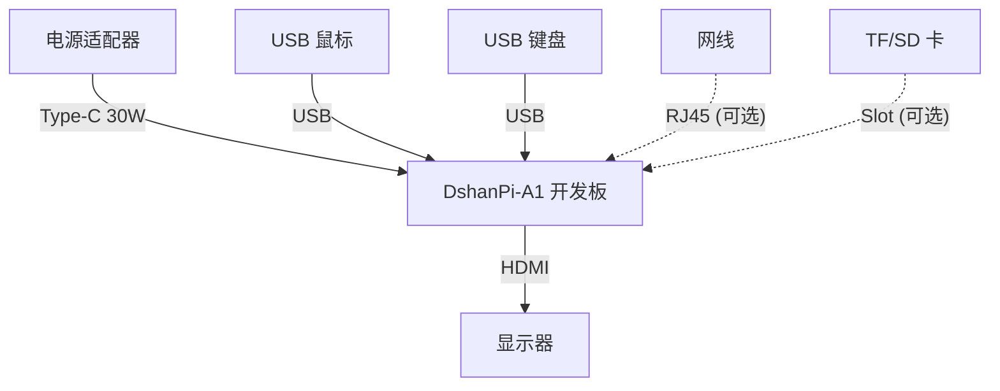

# 硬件连接指南

:::tip 提示
本指南针对首次使用 **DshanPi-A1** 开发板的用户，详细阐述标准的接线与开机流程，确保系统能够安全、正常运行。

开发板出厂默认烧录 **Armbian** 系统，请务必按照以下步骤完成硬件连接，再进行首次启动设置。
:::

## 快速启动连接图

## 基础硬件连接

### 1. 连接鼠标与键盘

*   **准备工作**：一套标准 USB 接口的鼠标和键盘（有线或无线均可）。
*   **操作步骤**：
    1.  将 USB 键盘和鼠标分别插入开发板的 USB 接口（支持 USB 2.0/3.0）。
    2.  如果是无线键鼠套装，将无线接收器插入任一 USB 接口即可。
*   **注意事项**：
    *   暂不支持蓝牙键盘/鼠标在 BIOS/Bootloader 阶段使用。
    *   请确保接口插紧，避免接触不良。

  
  

### 2. 连接显示器 (HDMI)

*   **准备工作**：
    *   1 根标准 HDMI 线。
    *   1 台支持 HDMI 输入的显示器或电视。
*   **操作步骤**：
    1.  将 HDMI 线的一端插入开发板的 **HDMI OUT** 接口。
    2.  另一端连接至显示设备的 HDMI 输入口。
    3.  开启显示器并切换至对应的 HDMI 信号源。
*   **说明**：建议使用高质量 HDMI 线材以确保 4K/8K 画面传输稳定。

### 3. 连接电源 (PD 30W)

*   **推荐设备**：官方认证的 **30W PD 电源适配器**。
*   **操作步骤**：
    1.  确认所有外设（显示器、键鼠等）已连接完毕。
    2.  将 Type-C 电源线插入开发板的 **Type-C 供电接口**。
    3.  接通电源，开发板将自动启动。
*   **⚠️ 警告**：
    *   **严禁使用非 PD 协议或功率低于 30W 的电源适配器**，这可能导致系统不稳定或重启。
    *   使用非官方电源适配器造成的硬件损坏不在保修范围内。

---

## 进阶硬件连接

### 串口调试 (Serial Debug)

通过 USB 转 TTL 模块连接开发板的调试串口，可用于底层调试和系统日志查看。

**接线定义：**

| DshanPi-A1 引脚 | USB 转 TTL 模块引脚 |
| :---: | :---: |
| **TX** | RX |
| **RX** | TX |
| **GND** | GND |
| VCC | (无需连接) |

**引脚位置示意：**

为了清晰展示引脚定义，请参考下图：

**实物连接效果：**

### PCIe WiFi 模块安装

开发板背面预留了 M.2 Key-E 接口，支持安装 PCIe WiFi 6 模块。

1.  **对准接口**：将模块金手指对准 M.2 插槽缺口插入。
2.  **固定模块**：按下模块尾部，拧紧固定螺丝。

  
  

### 散热器安装

为保证高性能运行时的稳定性，建议安装主动散热器。

1.  **对准孔位**：将散热器底座对准开发板上的两个安装孔。
2.  **按压固定**：分别按下两个固定柱的卡扣，直至听到“咔哒”声。
3.  **连接风扇**：将风扇电源线插入板载风扇接口（注意正负极防呆设计）。

  
  

### HDMI-IN 视频输入

DshanPi-A1 支持 **HDMI-IN** 功能，可作为视频采集卡使用。

*   使用 Micro HDMI 转标准 HDMI 线缆，将 PC 或其他视频源连接至开发板的 **HDMI IN** 接口。

### DP 显示输出 (Type-C)

开发板的 USB 3.0 OTG 接口支持 **DP Alt Mode**，可连接 Type-C 显示器或通过转接线连接 DP 显示器。

*   将 Type-C 线缆一端插入开发板的 **USB 3.0 OTG** 接口，另一端连接显示设备。

