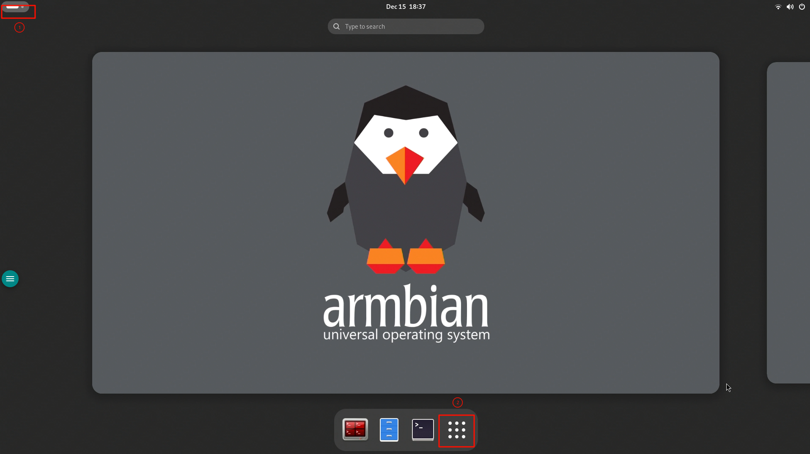
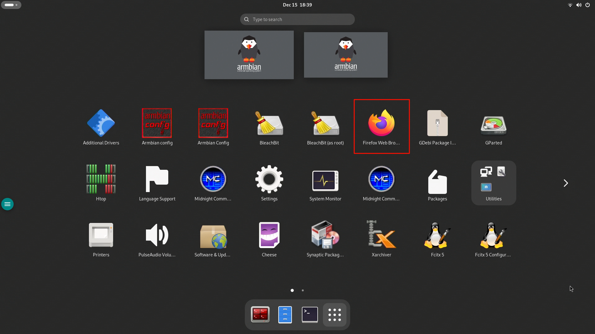
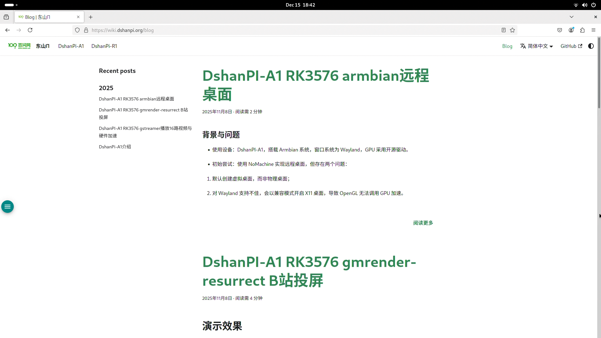
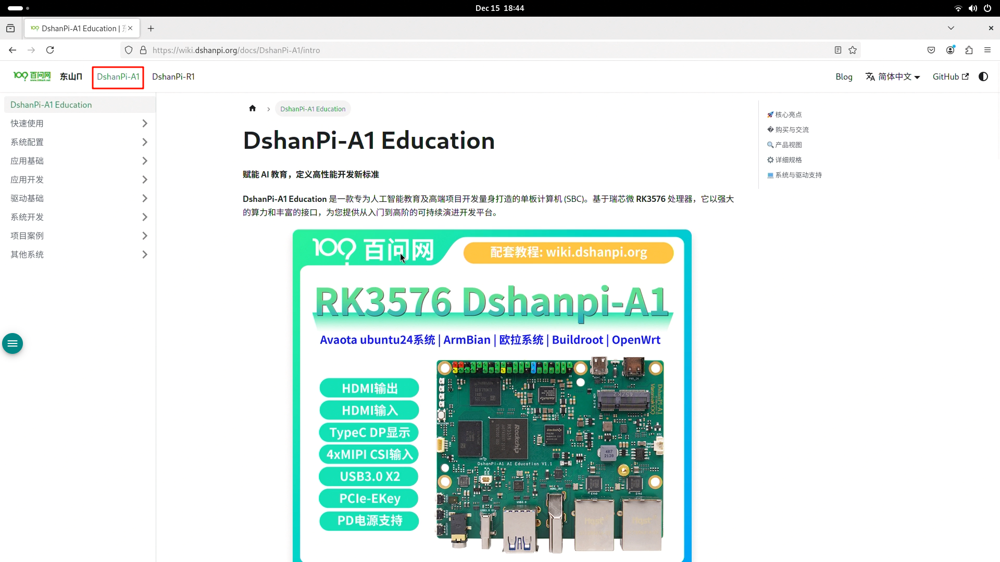

# 浏览器使用指南

本章节将介绍如何在 DShanPi-A1 上使用浏览器访问互联网。

:::info 前提条件
在使用浏览器之前，请确保 DShanPi-A1 已经成功连接到互联网。
:::

## 1. 启动浏览器

1.  进入桌面环境。
2.  点击左上角的 **“应用程序”** 图标（通常为白色横杆或 Logo）。
3.  在应用列表中点击 **“更多应用”**。

4.  找到并点击 **浏览器** 图标（例如 Firefox 火狐浏览器）。

## 2. 浏览网页与获取文档

浏览器启动后，你可以通过它访问各类网站。

### 访问 DShanPi 文档中心

1.  在浏览器地址栏中输入 `wiki.dshanpi.org` 并回车。
2.  页面加载后，你将看到 DShanPi 的官方文档站点。

3.  点击页面上方的 **“DshanPi-A1”** 选项卡，即可进入 DshanPi-A1 的专属教程页面。在这里，你可以找到关于 DshanPi-A1 的所有操作指南和技术文档。

:::tip 提示
建议将文档站点添加到浏览器书签，以便日后快速查阅。
:::
