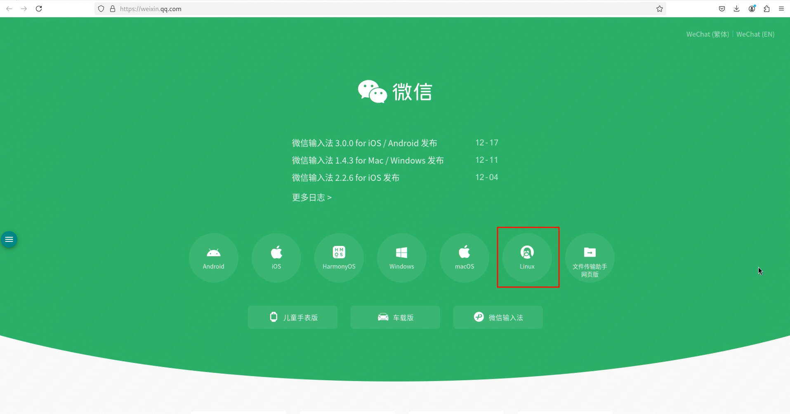
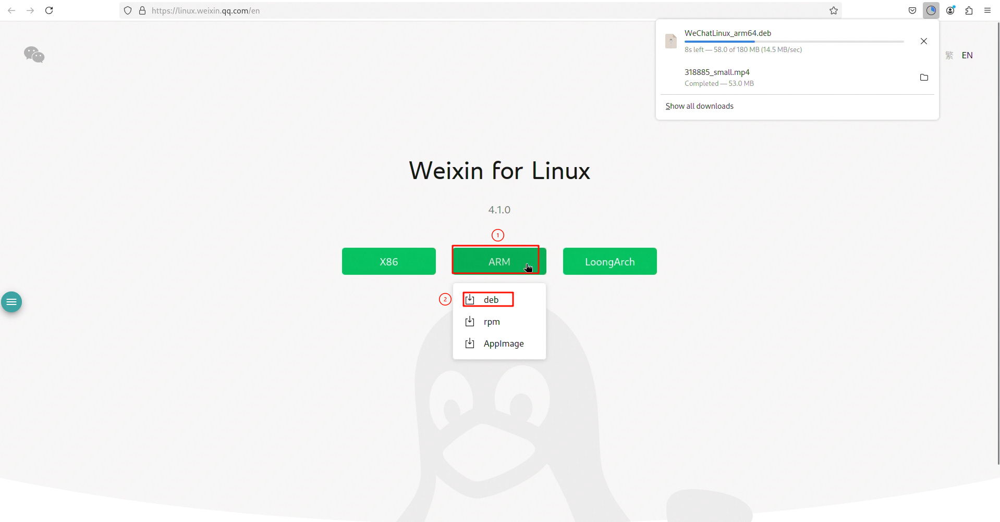
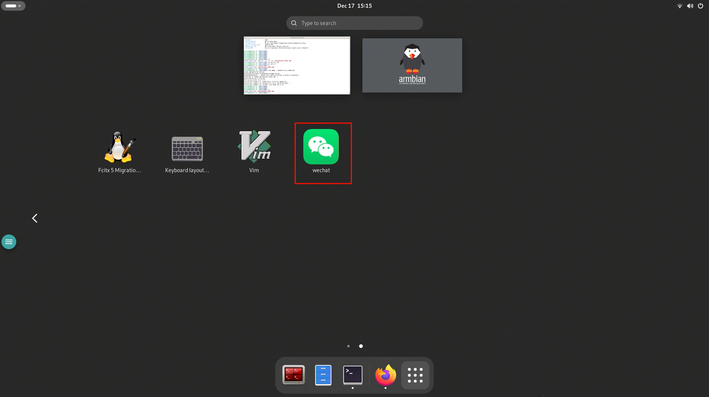
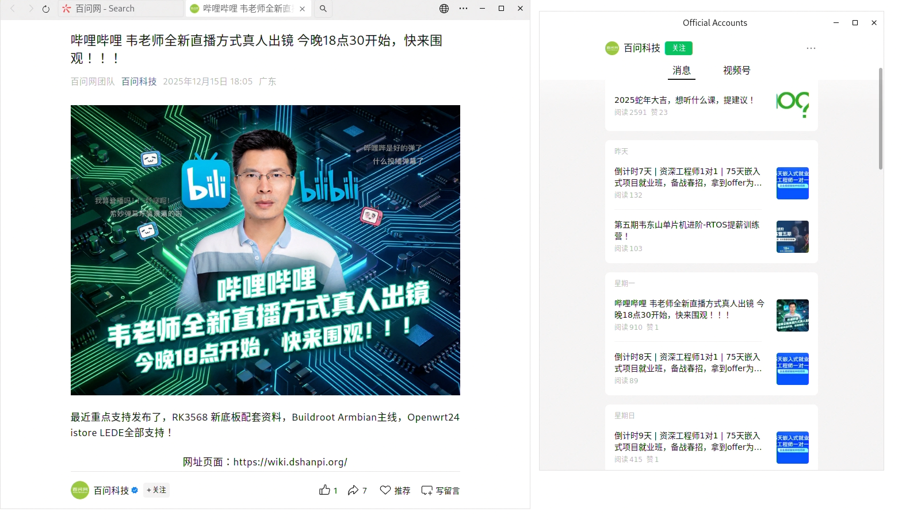
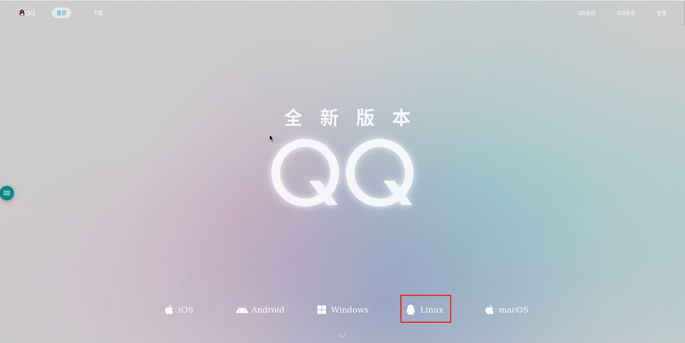
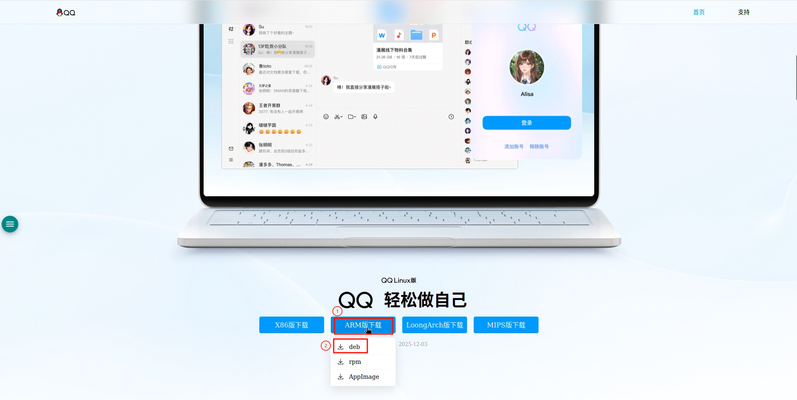
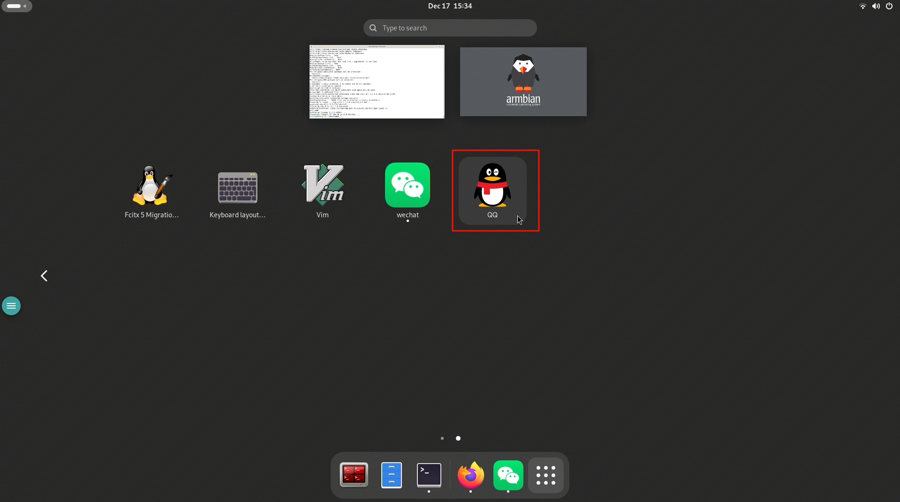
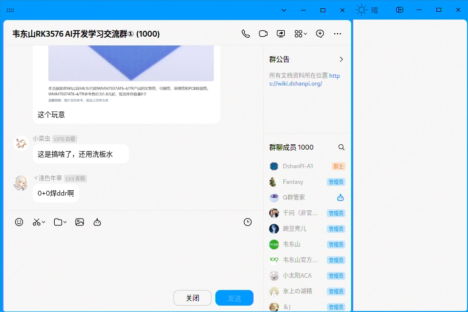

# 社交应用安装指南

本章节将指导您在 DshanPi-A1 上安装常用的社交软件：**微信 (WeChat)** 和 **QQ**。

:::info 架构说明
DshanPi-A1 采用 **ARM64 (aarch64)** 架构，因此在下载软件时，请务必选择对应的 ARM 版本安装包。
:::

## 1. 微信 (WeChat)

### 1.1 下载安装包

1.  访问 [微信官方下载页面](https://weixin.qq.com/)。
2.  点击 **Linux** 图标。
3.  在下载列表中找到 **ARM64** 架构，并选择下载 **deb** 格式的安装包。





### 1.2 安装应用

下载完成后，安装包默认位于 `~/Downloads` 目录。请打开终端并执行以下命令进行安装：

```bash title="安装微信"
cd ~/Downloads
# 请根据实际下载的文件名修改（支持 Tab 键自动补全）
sudo dpkg -i WeChatLinux_arm64.deb
```

### 1.3 启动与登录

1.  点击桌面左上角的 **“应用程序”** 图标。
2.  在应用列表中找到 **微信** 图标并点击启动。
3.  启动后即可使用手机扫码登录。





---

## 2. QQ

### 2.1 下载安装包

1.  访问 [QQ 官方下载页面](https://im.qq.com/index/)。
2.  点击 **Linux** 图标。
3.  找到 **ARM 版本**，并下载对应的 **deb** 格式安装包。





### 2.2 安装应用

同样地，使用终端进行安装：

```bash title="安装 QQ"
cd ~/Downloads
# 请将文件名替换为您实际下载的版本
sudo dpkg -i QQ_3.2.22_251203_arm64_01.deb
```

:::warning 常见问题：依赖缺失
如果在安装过程中遇到 `dependency problems` 报错，提示缺少 `xdg-utils` 等依赖，请执行以下命令进行自动修复：

```bash
sudo apt update
sudo apt install -f
```
修复完成后，系统会自动完成 QQ 的安装。
:::

### 2.3 启动与登录

1.  在应用程序列表中找到 **QQ** 图标。
2.  点击启动并扫码登录。




