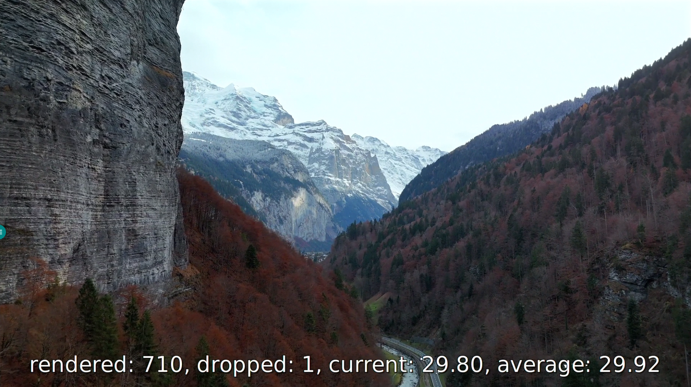

# 视频播放指南

在嵌入式 Linux 系统中，**GStreamer** 是最强大的多媒体框架之一。相比于直接使用 ffmpeg，GStreamer 提供了更灵活的管道（Pipeline）机制，能够更好地调用硬件加速（如 VPU）并适配显示子系统（如 DRM/KMS 或 Framebuffer）。

本教程将指导您如何在 DshanPi-A1 上安装 GStreamer 环境，并通过命令行播放视频。

:::info 学习目标
*   安装 GStreamer 核心库及常用插件。
*   使用 `gst-play-1.0` 工具播放本地及网络视频。
*   掌握高级播放参数，进行性能测试与故障排查。
:::

## 1. 环境准备

在开始播放前，我们需要安装 GStreamer 的核心库、插件以及常用工具。

### 1.1 更新与安装

首先更新软件源，然后一次性安装所需的 GStreamer 组件：

```bash title="安装 GStreamer 全家桶"
sudo apt update

sudo apt install -y \
    gstreamer1.0-plugins-base-apps \
    gstreamer1.0-plugins-bad \
    gstreamer1.0-plugins-ugly \
    gstreamer1.0-libav \
    gstreamer1.0-tools \
    gstreamer1.0-plugins-base \
    gstreamer1.0-plugins-good \
    gstreamer1.0-alsa \
    gstreamer1.0-pulseaudio
```

### 1.2 验证安装

安装完成后，检查 GStreamer 版本以确保环境就绪：

```bash
gst-inspect-1.0 --version
```

:::tip 成功标志
如果终端输出显示 GStreamer 版本号（例如 `1.24.x`），则说明安装成功。
:::

## 2. 使用 gst-play-1.0 播放视频

`gst-play-1.0` 是 GStreamer 自带的命令行播放器。它基于 `playbin` 高级元件，能自动处理解封装、解码和音视频同步，非常适合快速测试。

### 2.1 基础用法

基本语法非常简单：

```bash
gst-play-1.0 [选项] <URI/文件路径>
```

**常用场景示例：**

```bash title="播放不同来源的视频"
# 播放本地文件
gst-play-1.0 my_video.mp4

# 播放网络视频 (HTTP)
gst-play-1.0 http://commondatastorage.googleapis.com/gtv-videos-bucket/sample/BigBuckBunny.mp4

# 播放 RTSP 流
gst-play-1.0 rtsp://192.168.1.100:8554/stream
```

### 2.2 进阶：性能测试与硬件直通

为了测试硬件性能或排除软件干扰，我们可以使用更底层的参数配置。以下命令演示了如何**监控实时帧率**并**直接输出到硬件**：

```bash title="高级播放指令"
gst-play-1.0 --flags=3 \
    --videosink="fpsdisplaysink video-sink=waylandsink signal-fps-measurements=true text-overlay=true sync=true" \
    --audiosink="alsasink device=hw:0,0" \
    318885_small.mp4
```

#### 关键参数解析

**A. 功能控制 (`--flags=3`)**

这是一个位掩码参数，用于精细控制播放器组件：
*   `1` (0x01): 启用视频
*   `2` (0x02): 启用音频
*   `4` (0x04): 启用字幕

:::note 为什么是 3？
设置 `flags=3` (1+2) 意味着**仅启用视频和音频，强制禁用字幕**。
:::

**B. 视频输出 (`--videosink`)**

这里定义了一个复杂的视频处理链：
*   **`fpsdisplaysink`**: 测量并显示播放帧率。
*   **`video-sink=waylandsink`**: 指定使用 Wayland 后端。它利用 DMABuf 实现零拷贝渲染，比旧的 X11 (`xvimagesink`) 更高效。
*   **`text-overlay=true`**: 将 FPS 数值直接打印在视频画面上。
*   **`sync=true`**: **同步控制**。
    *   `true` (默认): 正常播放，严格同步音画。
    *   `false` (跑分模式): 忽略时间戳，全速解码播放，用于测试硬件极限性能。

**C. 音频输出 (`--audiosink`)**

*   **`alsasink`**: 绕过 PulseAudio/PipeWire 音频服务，直接调用底层 ALSA 驱动。
*   **`device=hw:0,0`**: 强制指定输出到声卡 0 设备 0，确保音频通路最简短、延迟最低。

### 2.3 播放效果预览

执行上述命令后，视频将在屏幕上流畅播放，底部会实时显示当前的帧率信息：


