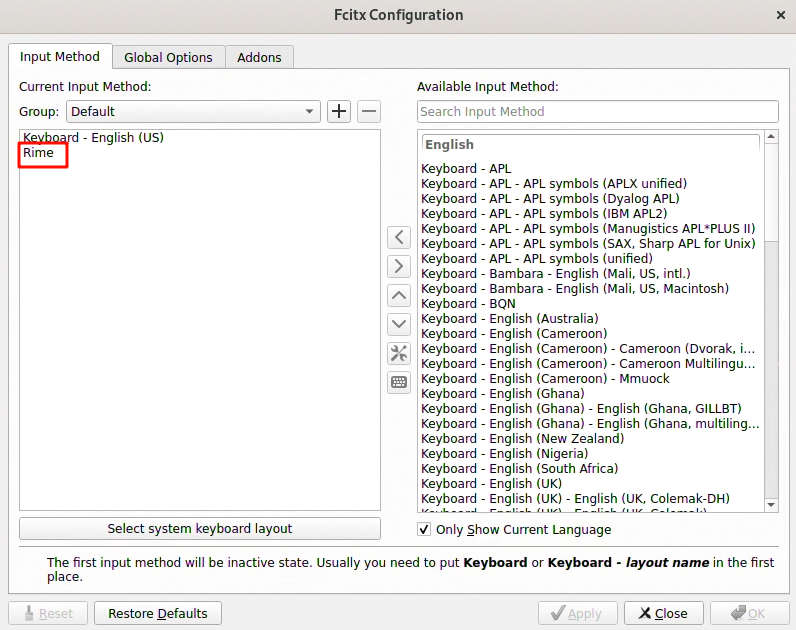

# 输入法配置指南

本文档将带领你在 **Ubuntu 24.04 (Armbian)** 的 **Wayland** 桌面环境下，打造极致流畅的中文输入体验。我们将部署 **Fcitx5** 输入法框架，并配置备受好评的 **雾凇拼音 (Rime Ice)** 方案。

:::info 为什么选择这就方案？
*   **Wayland 完美兼容**：解决原生 Wayland 环境下中文输入痛点。
*   **游戏/终端支持**：修复 GLFW 应用（如 Minecraft、Kitty）无法调出输入法的问题。
*   **雾凇拼音**：长期维护、词库丰富、体验极佳的 Rime 配置。
:::

---

## 1. 安装核心组件

首先，我们需要更新软件源并安装 Fcitx5 框架、Rime 引擎及其依赖。

:::tip 关键组件
我们特意安装了 `librime-plugin-lua`，它为雾凇拼音提供了 **动态日期**、**以词定字** 等高级功能支持。
:::

```bash
sudo apt update

sudo apt install -y fcitx5 fcitx5-rime fcitx5-config-qt \
  fcitx5-frontend-qt5 fcitx5-frontend-gtk3 fcitx5-frontend-gtk4 \
  im-config librime-plugin-lua
```

## 2. 配置环境变量 (关键)

为适配 Wayland 环境，需设置全局环境变量。

:::warning 注意
我们推荐使用 `environment.d` 方式配置，而非传统的 `.bashrc`，这能确保环境变量在系统级所有会话中生效，避免应用无法识别输入法。
:::

### 创建并写入配置文件

```bash
mkdir -p ~/.config/environment.d
nano ~/.config/environment.d/fcitx.conf
```

将以下内容粘贴至文件中：

```conf title="~/.config/environment.d/fcitx.conf"
XMODIFIERS=@im=fcitx
GTK_IM_MODULE=fcitx
QT_IM_MODULE=fcitx
INPUT_METHOD=fcitx
SDL_IM_MODULE=fcitx

# 兼容性设置：修复 Kitty、Minecraft 等 GLFW 应用的输入问题
GLFW_IM_MODULE=ibus
```

> 按 `Ctrl+O` 保存，`Ctrl+X` 退出。

## 3. 激活 Fcitx5

将 Fcitx5 设置为系统默认输入法框架：

```bash
im-config -n fcitx5
```

## 4. 部署雾凇拼音 (Rime Ice)

我们将使用 [雾凇拼音](https://github.com/iDvel/rime-ice) 的最新配置覆盖 Rime 默认配置。

```bash
# 1. 创建配置目录
mkdir -p ~/.local/share/fcitx5/rime

# 2. 备份现有配置（可选，推荐）
mv ~/.local/share/fcitx5/rime ~/.local/share/fcitx5/rime.bak 2>/dev/null

# 3. 克隆雾凇拼音仓库
git clone https://github.com/iDvel/rime-ice.git ~/.local/share/fcitx5/rime --depth 1
```

## 5. 定制 Rime 设置

创建 `default.custom.yaml` 文件，启用“雾凇拼音”方案并将候选词数量调整为 9。

```bash
cat > ~/.local/share/fcitx5/rime/default.custom.yaml <<EOF
patch:
  "menu/page_size": 9
  schema_list:
    - schema: rime_ice
EOF
```

## 6. 设置开机自启动

确保 Fcitx5 随系统启动自动运行：

```bash
mkdir -p ~/.config/autostart
cp /usr/share/applications/org.fcitx.Fcitx5.desktop ~/.config/autostart/
```

## 7. 重启系统

:::danger 重启生效
配置完成后，**必须重启系统** 以应用环境变量和输入法配置。
:::

```bash
sudo reboot
```

---

## 8. 图形界面配置与验证

重启进入桌面后，需进行最后的确认和测试。

### 启用 Rime 输入法

1.  打开 **Fcitx5 配置** 工具（`fcitx5-config-qt`）。
2.  在右侧 **"可用输入法"** 栏搜索 **"Rime"** (或“中州韵”)。
3.  点击 **"\<"** 按钮将其添加至左侧 **"当前输入法"** 栏。
4.  **推荐排序**：
    *   ⌨️ 键盘 - 英语(美国)
    *   ❄️ Rime



### 功能验证

使用快捷键（通常为 `Ctrl + Space` ）切换输入法进行测试：

*   **基础输入**：输入 `nihao`，应显示中文候选词。
*   **翻页测试**：输入 `=` 翻下一页，`-` 翻上一页。

:::tip 小技巧
如果配置后仍无法输入中文，再次重启系统通常能解决问题。
:::

## ❓ 常见问题与解决

### 冲突排查：移除 IBus 框架

如果配置无误且多次重启后仍无法输入中文，可能是因为系统预装的 **IBus** 输入法框架与 Fcitx5 产生冲突。

:::danger 风险操作
以下命令将彻底卸载 IBus 及其相关组件。这通常是安全的，但如果你的系统中有其他依赖 IBus 的关键应用，请谨慎操作。
:::

执行以下命令彻底清除 IBus：

```bash title="彻底卸载 IBus 框架"
sudo apt purge ibus*
rm -rf ~/.config/ibus
rm -rf ~/.cache/ibus
sudo apt autoremove --purge
sudo apt autoclean
```

**执行完毕后，请再次重启系统**。这将清除潜在的冲突，让 Fcitx5 能够正常接管输入法服务。