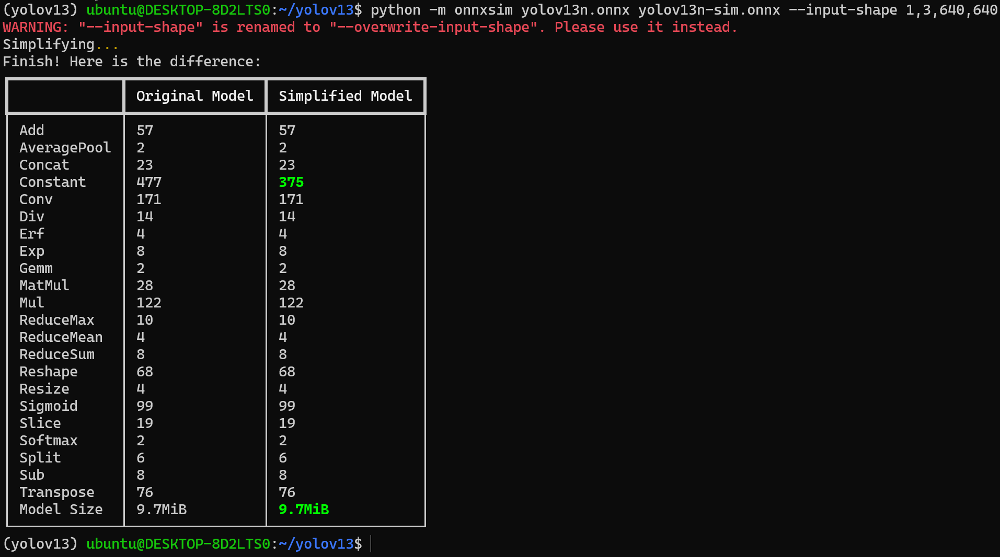
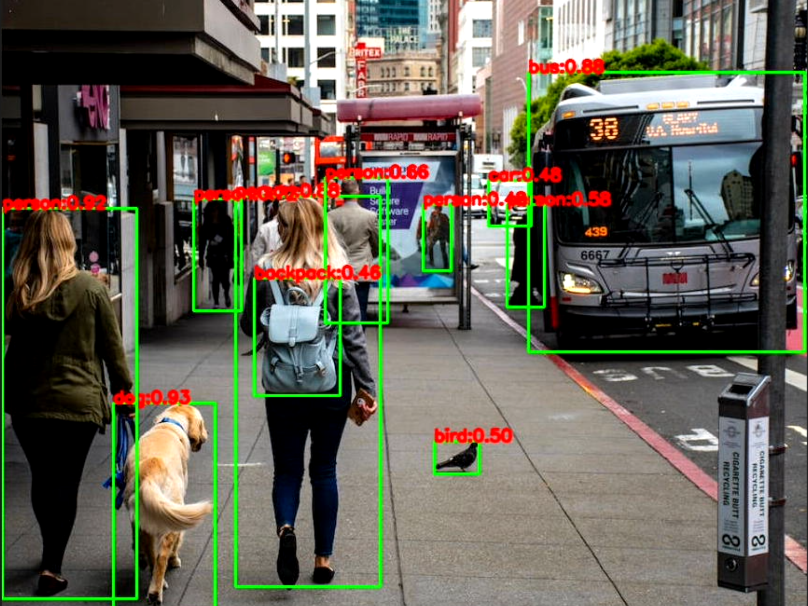
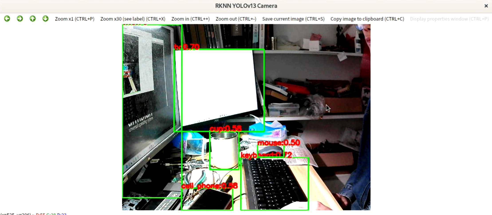

# YOLOV13模型部署

参考资料：

- [iMoonLab/yolov13: Implementation of "YOLOv13: Real-Time Object Detection with Hypergraph-Enhanced Adaptive Visual Perception".](https://github.com/iMoonLab/yolov13/tree/main)
- [kaylorchen/ai_framework_demo: 针对于ai_framefork的测试demo](https://github.com/kaylorchen/ai_framework_demo/tree/master)

源码获取链接:  https://pan.baidu.com/s/1ZqppMvmww0FPIrp7dJYBgA?pwd=45r3 提取码: 45r3 

- yolov13.zip：yolov3源码压缩包，包含模型、ONNX导出程序等。
- rknn-yolov13.tar.gz：RKNN模型转换程序、端侧推理程序。

## 1.获取模型

通过Git下载模型源码：

```
git clone https://github.com/iMoonLab/yolov13.git
```


在Linxu x86平台使用Conda创建虚拟环境：

```
conda create -n yolov13 python=3.11
conda activate yolov13
```


手动下载`flash-attn`等库。

```
wget https://github.com/Dao-AILab/flash-attention/releases/download/v2.7.3/flash_attn-2.7.3+cu11torch2.2cxx11abiFALSE-cp311-cp311-linux_x86_64.whl
```


安装YOLOV3依赖库:

```
pip install -r requirements.txt
```


可编译方式安装库

```
pip install -e .
```


下载预训练模型：[`YOLOv13-N`](https://github.com/iMoonLab/yolov13/releases/download/yolov13/yolov13n.pt) [`YOLOv13-S`](https://github.com/iMoonLab/yolov13/releases/download/yolov13/yolov13s.pt) [`YOLOv13-L`](https://github.com/iMoonLab/yolov13/releases/download/yolov13/yolov13l.pt) [`YOLOv13-X`](https://github.com/iMoonLab/yolov13/releases/download/yolov13/yolov13x.pt)，这里使用YOLOV13-N。


## 2.修改源码

修改导出ONNX模型的检测头，源码位置：`ultralytics/nn/modules/head.py`，将原来的

```
 def forward(self, x):
        """Concatenates and returns predicted bounding boxes and class probabilities."""
        if self.end2end:
            return self.forward_end2end(x)

        for i in range(self.nl):
            x[i] = torch.cat((self.cv2[i](x[i]), self.cv3[i](x[i])), 1)
        if self.training:  # Training path
            return x
        y = self._inference(x)
        return y if self.export else (y, x)
```

修改为：

```
 def forward(self, x):
        # 导出 onnx 增加
        y = []
        for i in range(self.nl):
            t1 = self.cv2[i](x[i])
            t2 = self.cv3[i](x[i])
            y.append(t1)
            y.append(t2)
        return y
```


## 3.新增导出程序

在项目的源码目录下，新建`export_onnx.py`，填入以下内容：

```
from ultralytics import YOLO
model = YOLO('yolov13n.pt')  # Replace with the desired model scale
model.export(format="onnx", half=True)
```

执行程序：

```
python3 export_onnx.py
```

执行完成可以在当前目录下看到导出的`yolov13n.onnx`模型：

```
(yolov13) ubuntu@DESKTOP-8D2LTS0:~/yolov13$ ls
LICENSE                                                                                  requirements.txt
README.md                                                                                tests
assets                                                                                   ultralytics
bus.jpg                                                                                  ultralytics.egg-info
docker                                                                                   yolov13l.pt
examples                                                                                
export_onnx.py                                                                           yolov13n.onnx
flash_attn-2.7.3+cu11torch2.2cxx11abiFALSE-cp311-cp311-linux_x86_64.whl                  yolov13n.pt
mkdocs.yml                                                                               yolov13s.pt
paper-yolov13.pdf                                                                        
pyproject.toml  
```


## 4.简化ONNX模型

安装ONNX库：

```
pip install onnxsim
```

执行模型简化：

```
python -m onnxsim yolov13n.onnx yolov13n-sim.onnx --input-shape 1,3,640,640
```

运行效果如下：




## 5.模型转换

将ONNX模型、测试图像、测试图像路径文件、模型转换程序：

```
baiwen@dshanpi-a1:~/rknn-yolov13$ ls
bus.jpg  convert.py  dataset.txt  yolov13n-sim.onnx
```

激活模型转换环境：

```
conda activate rknn-toolkit2
```

执行模型转换程序：

```
python3 convert.py ./yolov13n-sim.onnx rk3576 
```

运行效果：

```
(rknn-toolkit2) baiwen@dshanpi-a1:~/rknn-yolov13$ python3 convert.py ./yolov13n-sim.onnx rk3576
I rknn-toolkit2 version: 2.3.2
--> Config model
done
--> Loading model
I Loading : 100%|██████████████████████████████████████████████| 375/375 [00:00<00:00, 10454.67it/s]
done
...
I OpFusing 0 : 100%|██████████████████████████████████████████████| 100/100 [00:26<00:00,  3.81it/s]
I OpFusing 1 : 100%|██████████████████████████████████████████████| 100/100 [00:26<00:00,  3.73it/s]
I OpFusing 2 : 100%|██████████████████████████████████████████████| 100/100 [00:30<00:00,  3.23it/s]
W build: found outlier value, this may affect quantization accuracy
                        const name                          abs_mean    abs_std     outlier value
                        onnx::Conv_2088                     1.12        1.02        10.860
                        model.32.cv3.0.1.1.conv.weight      0.64        0.60        -10.624
I GraphPreparing : 100%|█████████████████████████████████████████| 532/532 [00:00<00:00, 850.16it/s]
I Quantizating : 100%|███████████████████████████████████████████| 532/532 [00:03<00:00, 147.81it/s]
I rknn building ...

I rknn building done.
done
--> Export rknn model
done
```


## 6.模型推理

### 6.1 图像推理

将测试图片、推理模型、推理程序都放在同一目录下，

```
baiwen@dshanpi-a1:~/rknn-yolov13$ ls
test.jpg    yolov13.py  yolov13.rknn
```

执行推理程序：

```
python3 yolov13.py
```

运行效果：

```
baiwen@dshanpi-a1:~/rknn-yolov13$ python3 yolov13.py                                     This is main ...
W rknn-toolkit-lite2 version: 2.3.2
--> Load RKNN model
done
--> Init runtime environment
I RKNN: [14:34:42.340] RKNN Runtime Information, librknnrt version: 2.3.2 (429f97ae6b@2025-04-09T09:09:27)
I RKNN: [14:34:42.341] RKNN Driver Information, version: 0.9.8
I RKNN: [14:34:42.346] RKNN Model Information, version: 6, toolkit version: 2.3.2(compiler version: 2.3.2 (@2025-04-03T08:26:16)), target: RKNPU f2, target platform: rk3576, framework name: ONNX, framework layout: NCHW, model inference type: static_shape
W RKNN: [14:34:42.524] query RKNN_QUERY_INPUT_DYNAMIC_RANGE error, rknn model is static shape type, please export rknn with dynamic_shapes
W Query dynamic range failed. Ret code: RKNN_ERR_MODEL_INVALID. (If it is a static shape RKNN model, please ignore the above warning message.)
done
--> Running model
done
postprocess ...
(1, 64, 80, 80)
(1, 80, 80, 80)
(1, 64, 40, 40)
(1, 80, 40, 40)
(1, 64, 20, 20)
(1, 80, 20, 20)
detectResult: 81
final box num: 11
Save result to test_rknn_result.jpg
```

推理结果图片如下：




### 6.2 视频流推理

如果想使用USB摄像头进行实时推理（请提前将USB摄像头连接至DshanPI A1上），可执行：

```
python3 yolov13-video.py
```

运行效果如下：


