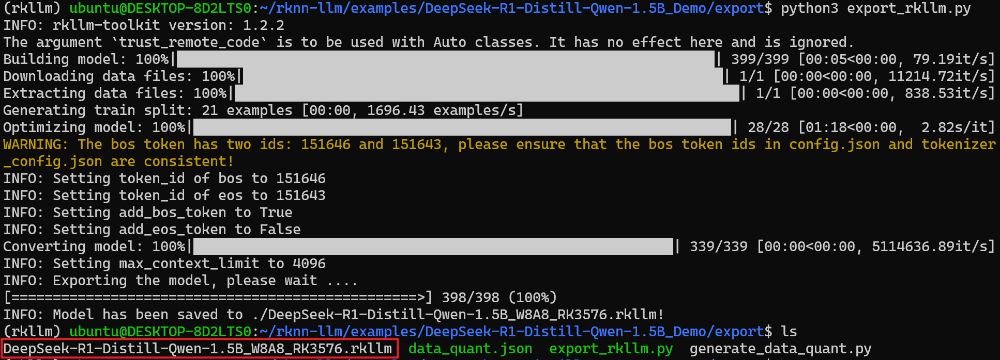
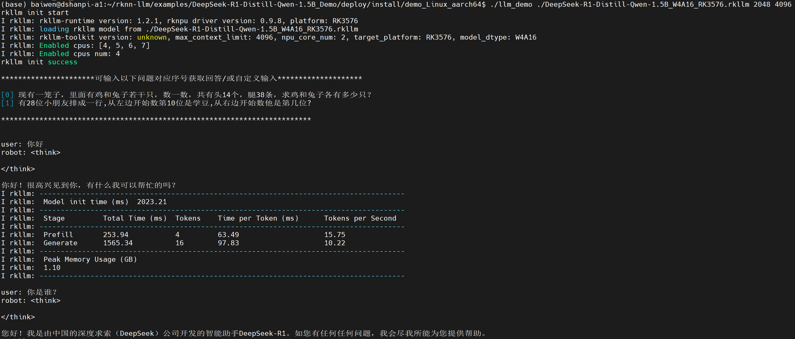
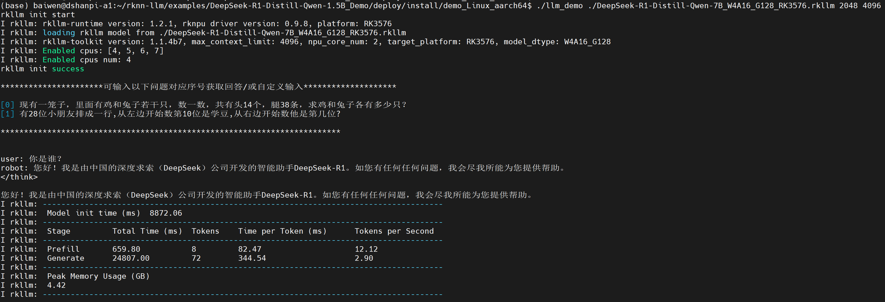

# DeepSeek-R1

## 0.模型获取

RK推理模型文件下载链接： https://pan.baidu.com/s/14BtJdoOSUiOsdeL_tqtVDg?pwd=rkll 提取码: rkll


## 1.模型转换(可选)

> 注意：模型转换需要在Linux x86主机上执行！

获取原始模型：

```
git lfs install
git clone https://huggingface.co/deepseek-ai/DeepSeek-R1-Distill-Qwen-1.5B
```

如果无法获取，可前往我们提供的网盘资料获取： https://pan.baidu.com/s/1eRRds8yKxLXuXwnM7BArHQ?pwd=7fkw 提取码: 7fkw 

### 1.1 激活环境

激活rkllm conda环境：

```
conda activate rkllm
```

### 1.2 生成模型量化校准数据集

生成模型量化校准文件:

```
cd examples/DeepSeek-R1-Distill-Qwen-1.5B_Demo/export
python3 generate_data_quant.py -m /path/to/DeepSeek-R1-Distill-Qwen-1.5B
```

假设我的原始模型放在`~/DeepSeek-R1-Distill-Qwen-1.5B/`目录下，则执行：

```
python3 generate_data_quant.py -m ~/DeepSeek-R1-Distill-Qwen-1.5B/
```

### 1.3 模型导出源码修改

1.修改导出模型源码`export_rkllm.py`的模型路径：

```
modelpath = '/path/to/DeepSeek-R1-Distill-Qwen-1.5B'
```

假设我的原始模型放在`/home/ubuntu/DeepSeek-R1-Distill-Qwen-1.5B`目录下，则修改为：

```
modelpath = '/home/ubuntu/DeepSeek-R1-Distill-Qwen-1.5B'
```

2.修改模型上下文最大值 max_context，代码原始为：

```
ret = llm.build(do_quantization=True, optimization_level=optimization_level, quantized_dtype=quantized_dtype,
                quantized_algorithm=quantized_algorithm, target_platform=target_platform, num_npu_core=num_npu_core, extra_qparams=qparams, dataset=dataset, hybrid_rate=0, max_context=4096)
```

默认为4096，该值越大，占用内存越大，建议根据内存版本修改，修改的值必须是32的倍数。(2GB RAM 建议 512，4GB RAM 建议 1024，8GB RAM 建议 2048，12GB RAM 建议 4096)

3.修改NPU核心为`2`

```
num_npu_core = 2
```

4.运行模型脚本：

```
python3 export_rkllm.py
```

运行效果如下：



模型转换完成后可以看到`DeepSeek-R1-Distill-Qwen-1.5B_W8A8_RK3576.rkllm`模型文件，后续可拷贝至DshanPI A1上运行！

## 2.编译可执行程序

> 注意：模型转换需要在DshanPI A1板端上执行！

1.进入源码目录

```
cd rknn-llm/examples/DeepSeek-R1-Distill-Qwen-1.5B_Demo/deploy/
```


2.修改交叉编译工具链

```
vi build-linux.sh
```

将原本的：

```
GCC_COMPILER_PATH=~/opts/gcc-arm-10.2-2020.11-x86_64-aarch64-none-linux-gnu/bin/aarch64-none-linux-gnu
```

修改为：

```
GCC_COMPILER_PATH=aarch64-linux-gnu
```

3.安装cmake

```
sudo apt install cmake -y
```


4.增加可执行权限并执行编译

```
chmod +x build-linux.sh
./build-linux.sh
```

运行效果：

```
baiwen@dshanpi-a1:~/rknn-llm/examples/DeepSeek-R1-Distill-Qwen-1.5B_Demo/deploy$ ./build-linux.sh
-- The C compiler identification is GNU 11.4.0
-- The CXX compiler identification is GNU 11.4.0
-- Detecting C compiler ABI info
-- Detecting C compiler ABI info - done
-- Check for working C compiler: /usr/bin/aarch64-linux-gnu-gcc - skipped
-- Detecting C compile features
-- Detecting C compile features - done
-- Detecting CXX compiler ABI info
-- Detecting CXX compiler ABI info - done
-- Check for working CXX compiler: /usr/bin/aarch64-linux-gnu-g++ - skipped
-- Detecting CXX compile features
-- Detecting CXX compile features - done
-- Configuring done
-- Generating done
-- Build files have been written to: /home/baiwen/rknn-llm/examples/DeepSeek-R1-Distill-Qwen-1.5B_Demo/deploy/build/build_linux_aarch64_Release
[ 50%] Building CXX object CMakeFiles/llm_demo.dir/src/llm_demo.cpp.o
[100%] Linking CXX executable llm_demo
[100%] Built target llm_demo
Consolidate compiler generated dependencies of target llm_demo
[100%] Built target llm_demo
Install the project...
-- Install configuration: "Release"
-- Installing: /home/baiwen/rknn-llm/examples/DeepSeek-R1-Distill-Qwen-1.5B_Demo/deploy/install/demo_Linux_aarch64/./llm_demo
-- Set runtime path of "/home/baiwen/rknn-llm/examples/DeepSeek-R1-Distill-Qwen-1.5B_Demo/deploy/install/demo_Linux_aarch64/./llm_demo" to ""
-- Installing: /home/baiwen/rknn-llm/examples/DeepSeek-R1-Distill-Qwen-1.5B_Demo/deploy/install/demo_Linux_aarch64/lib/librkllmrt.so
```


5.进入可执行文件目录

```
cd install/demo_Linux_aarch64/
```


6.将预训练和转换完成的模型文件传输至开发板端中

模型文件下载链接： https://pan.baidu.com/s/14BtJdoOSUiOsdeL_tqtVDg?pwd=rkll 提取码: rkll

```
baiwen@dshanpi-a1:~/rknn-llm/examples/DeepSeek-R1-Distill-Qwen-1.5B_Demo/deploy/install/demo_Linux_aarch64$  ls
DeepSeek-R1-Distill-Qwen-1.5B_W4A16_RK3576.rkllm  DeepSeek-R1-Distill-Qwen-7B_W4A16_G128_RK3576.rkllm  lib  llm_demo
```


## 3.模型推理

### 3.1 DeepSeek-R1 1.5B

1.导入依赖和环境变量

```
export LD_LIBRARY_PATH=./lib
export RKLLM_LOG_LEVEL=1
```

2.执行程序

```
./llm_demo ./DeepSeek-R1-Distill-Qwen-1.5B_W4A16_RK3576.rkllm 2048 4096
```



> 如果想退出可输入`Ctrl+C`。

### 3.2 DeepSeek-R1 7B

1.导入依赖和环境变量

```
export LD_LIBRARY_PATH=./lib
export RKLLM_LOG_LEVEL=1
```

2.执行程序

```
./llm_demo ./DeepSeek-R1-Distill-Qwen-7B_W4A16_G128_RK3576.rkllm 2048 4096
```



> 如果想退出可输入`Ctrl+C`。
