# 烧录系统至TF卡

:::tip 提示
本章节将详细讲解如何将 Armbian OS 系统镜像烧录至 DshanPi-A1 的TF卡存储中。此章节烧写方式只适用于 armbian openwrt系统，不适用 buildroot 等其他系统。

:::

## 1. 准备工作

### 1.1 硬件准备

进行烧录操作前，请准备以下硬件设备：

1. **DshanPi-A1 主板**：主板支持TF卡启动系统 EMMC启动系统，如果板载EMMC，同时接入了TF卡，上电后，会优先从TF卡启动系统。

2. **至少8GB Class10卡**：推荐使用闪迪的 红卡 至少8GB以上，建议32GB存储为最佳。不影响后续其他实验开发。

   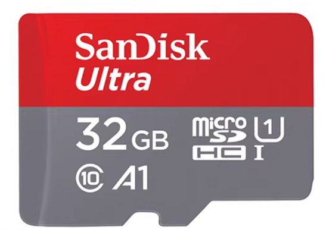

3. **TF卡读卡器**：烧写固件使用。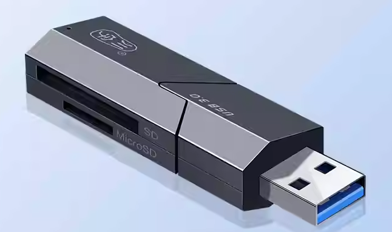

4. **电源适配器**：推荐使用 30W PD 电源适配器，确保供电稳定。

### 1.2 系统选择

访问 [/docs/QuickStart/ResourceAcquisition](/docs/QuickStart/ResourceAcquisition) 页面选择对应的系统镜像，请提前下载下来，并解压。

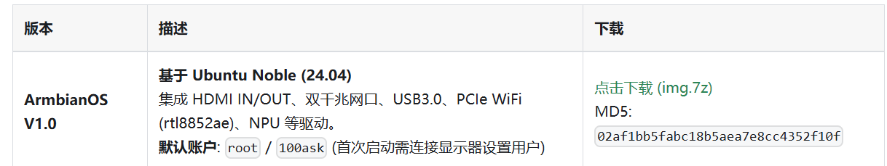

### 1.3 软件资源下载

访问 https://etcher.balena.io/ 下载镜像烧写工具。

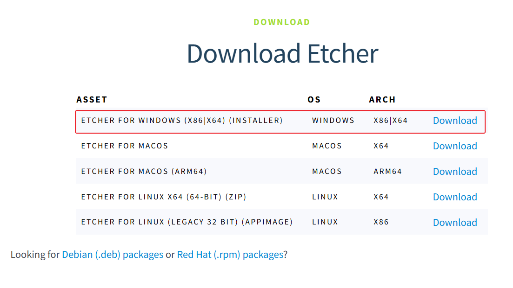

下载后需要安装，安装完成后找到 balenaEtcher 图标，windows下以右键管理员运行。

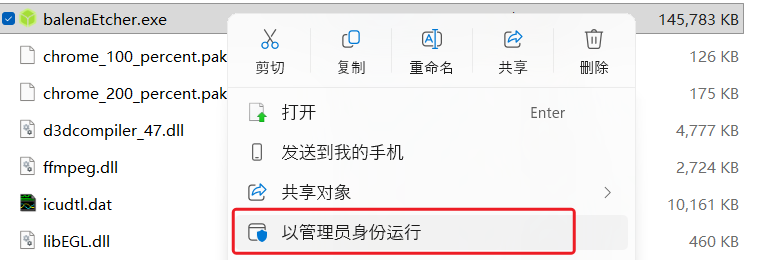

打开软件后，界面如下。

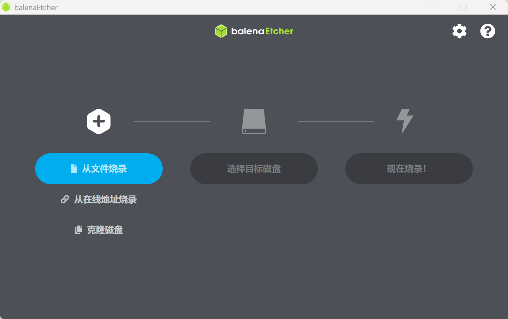

## 2. 烧写系统

选择解压后的系统镜像，将TF卡插入读卡器后，接到电脑USB接口。

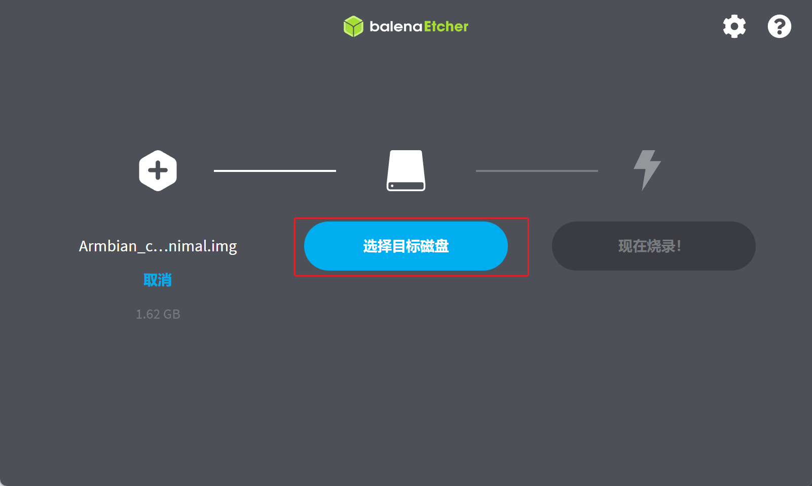

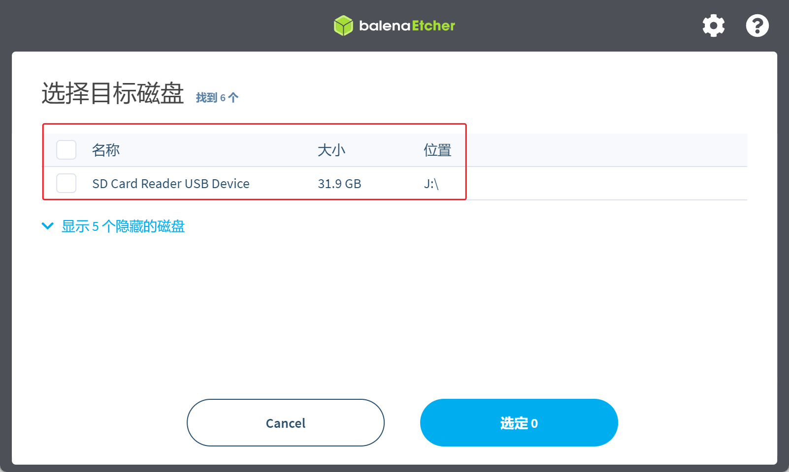

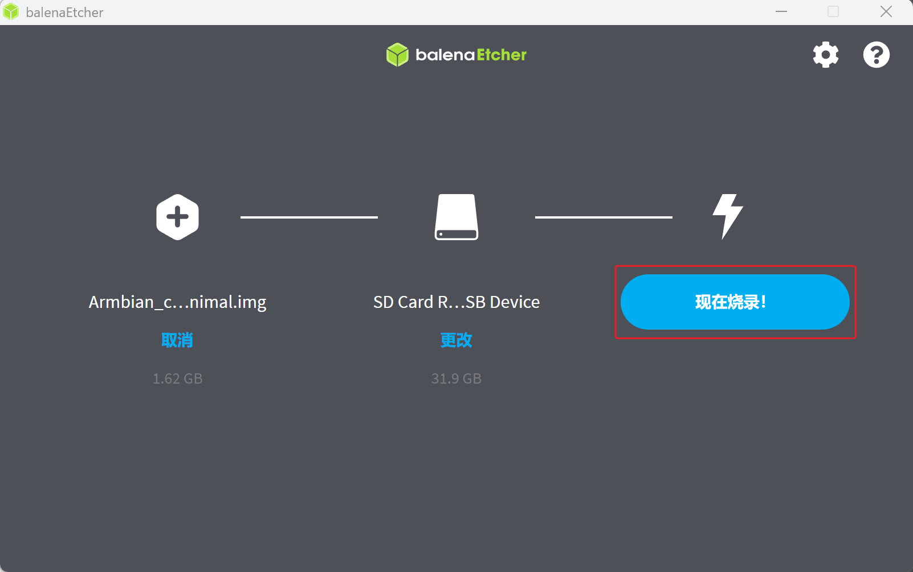

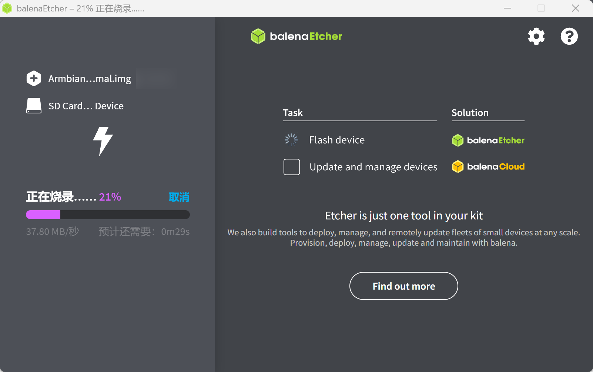

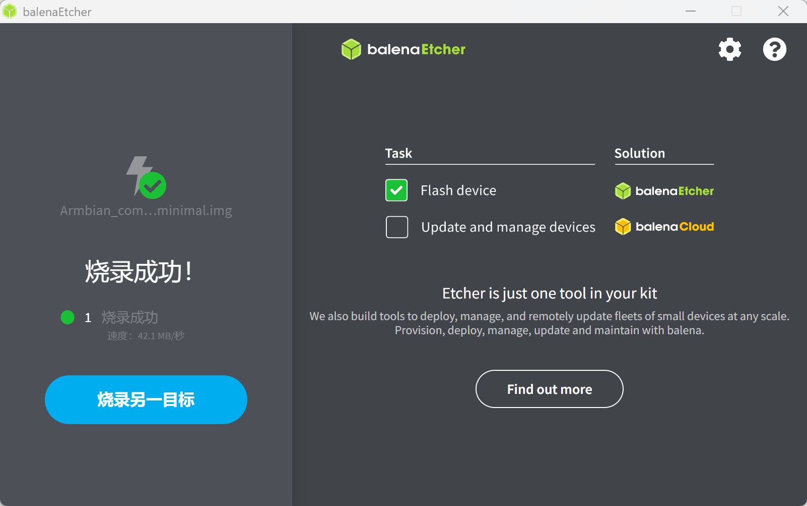

烧写完成后，将TF卡取下，参考下图红框位置，将卡插入A1板背面TF卡槽，然后通电启动，会自动从TF卡启动系统。

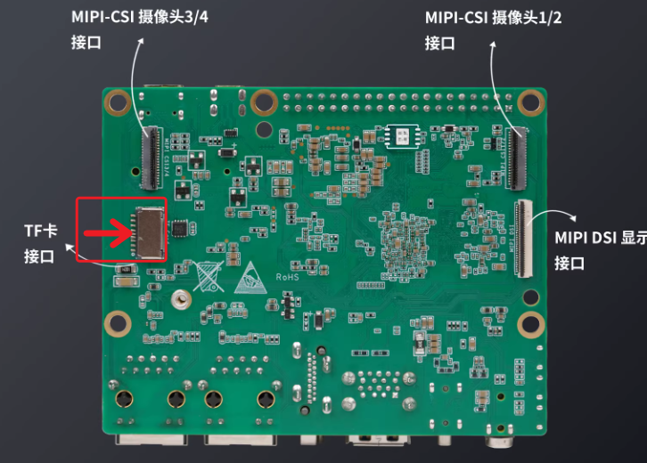
