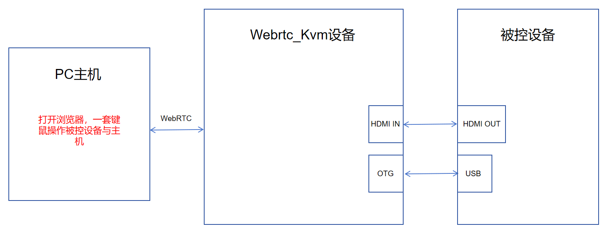
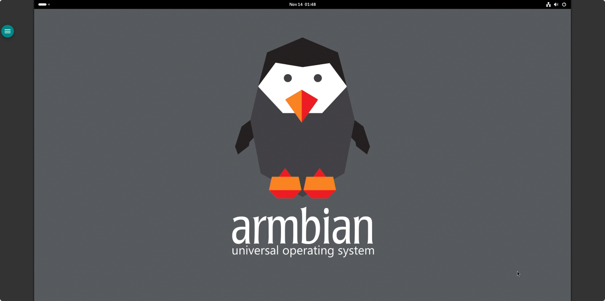

# Webrtc-kvm

本章奉上 Webrtc-Kvm 完整源码，并手把手教你如何在 DshanPi-A1 Armbian 系统上完成编译与部署，从零到运行，一站式搞定。

Webrtc-kvm 源码下载链接如下：

[webrtc-kvm](https://dl.100ask.net/Hardware/MPU/RK3576-DshanPi-A1/webrtc-kvm.tar.gz)

## 一、项目简介

webrtc-kvm 是一个基于 WebRTC 的远程键盘、视频和鼠标（KVM）控制系统，旨在实现对嵌入式设备的远程管理，适用于 IP-KVM 应用场景。该项目通过 WebRTC 协议提供低延迟、高安全性的音视频流传输，并结合 USB Gadget 技术模拟 HID 设备，实现远程键盘与鼠标的输入控制。其设计目标是支持多种硬件平台，如 Rockchip RK3588、树莓派等，具备良好的可扩展性与跨平台兼容能力。

项目采用 C++ 编写，后端服务负责视频采集、编码、WebRTC 流媒体传输及 USB 输入设备虚拟化，前端通过 HTTP API 提供配置与控制接口。整体架构模块化清晰，支持插件式扩展，便于适配不同视频编解码器与输入设备。

## 二、项目结构

webrtc-kvm 项目采用分层模块化结构，主要目录包括：

- `assets/`：包含默认配置文件 `config.yaml` 与 Web 资源
- `configs/`：针对不同硬件平台的 YAML 配置文件，如 `webrtc-rk3588.yaml`、`webrtc-rpi-unicam.yaml` 等
- `external/`：前端依赖库，如 Material Components、xterm.js
- `src/`：核心源码目录，包含抽象层、算法、输入、视频、WebRTC、HTTP 服务等模块
- `src/main/`：主程序入口与初始化逻辑
- `src/plugins/`：支持多种视频处理后端（如 FFmpeg SWScale、RKMPP）
- `README.md`：项目说明与配置示例

该结构支持灵活配置与多平台部署，通过 YAML 文件定义硬件参数与流媒体链路，实现“一次编码，多平台运行”。

~~~mermaid
graph TB
subgraph "配置"
A[configs/*.yaml]
B[assets/config.yaml]
end
subgraph "核心模块"
C[src/main/main.cpp]
D[src/webrtc_kvm.h]
E[src/http/httpd.cpp]
F[src/gadget/initialize.cpp]
G[src/input/input.cpp]
H[src/video/stream.h]
I[src/webrtc/webrtc.h]
end
subgraph "功能子系统"
J[HTTP API]
K[USB Gadget]
L[视频流处理]
M[WebRTC 通信]
end
A --> C
B --> C
C --> D
D --> E & F & G & H & I
E --> J
F --> K
G --> K
H --> L
I --> M
~~~

## 三、系统架构概述

webrtc-kvm 系统由四大核心子系统构成：HTTP API 接口、USB Gadget 虚拟化、视频流处理链与 WebRTC 通信层。各子系统通过全局上下文 `webrtc_kvm` 协同工作。

~~~mermaid
graph LR
A[客户端浏览器] --> B[WebRTC]
B --> C[视频流处理]
C --> D[视频采集/编码]
E[远程用户输入] --> F[USB Gadget]
F --> G[输入事件处理]
G --> C
H[YAML 配置] --> I[HTTP API]
I --> J[系统初始化]
J --> C & F & B
~~~

## 四、构建与部署

在 DshanPi-A1 Armbian 系统中编译这个项目的步骤如下：

**1. 获取源码**

执行以下指令（如果前面下载了压缩包，这一步可以忽略）：

~~~bash
git clone https://github.com/BigfootACA/webrtc-kvm.git
~~~

**2. 搭建编译环境**

执行以下指令：

~~~bash
sudo apt install libmicrohttpd-dev libyaml-cpp-dev libjsoncpp-dev uuid-dev libssl-dev libpam0g-dev python3-pyelftools
~~~

由于仓库源不存在 libdatachannel 依赖，需要编译相应的源码，执行以下操作：

~~~bash
git clone --recursive https://github.com/paullouisageneau/libdatachannel.git
cd libdatachannel
mkdir build && cd build
cmake -DCMAKE_BUILD_TYPE=Release -DCMAKE_INSTALL_PREFIX=/usr/local ..
make -j$(nproc)
sudo make install
sudo ldconfig
~~~

**3. 编译webrtc-kvm源码**

进入webrtc-kvm源码路径，执行以下指令：

~~~bash
cd webrtc-kvm
meson setup builddir -Dclient=disabled
meson compile -C builddir
sudo meson install -C builddir
sudo ldconfig
~~~

编译、安装后，执行以下指令运行：

~~~bash
sudo ln -sf /usr/local/lib/aarch64-linux-gnu/webrtc-kvm /usr/local/lib/webrtc-kvm
sudo cp ./configs/webrtc-rk3576-rk628d.yaml /usr/local/etc/webrtc-kvm/config.yaml -rfd
sudo webrtc-kvm -f /usr/local/etc/webrtc-kvm/config.yaml 
sudo systemctl start webrtc-kvm
sudo systemctl status webrtc-kvm
sudo systemctl enable webrtc-kvm
~~~

## 五、上机实验

这里，dshanpi-a1 本地的 IP 地址是：192.168.1.54，可以在浏览器上打开以下地址：

~~~bash
http://192.168.1.54:2345/
~~~

运行界面如下：

硬件连接步骤如下：

① 使用dshanpi-a1 配套的 HDMI IN线，连接Webrtc_Kvm设备与被控设备。

② 使用一根usb typec线连接Webrtc_Kvm设备与被控设备。

③ PC端打开浏览器，输入 `http://192.168.1.54:2345/` 。

这里使用两个dshanpi-a1进行演示，其中一个dshanpi-a1运行Webrtc_Kvm，另一个是被控设备，PC端浏览器实际运行如下：

