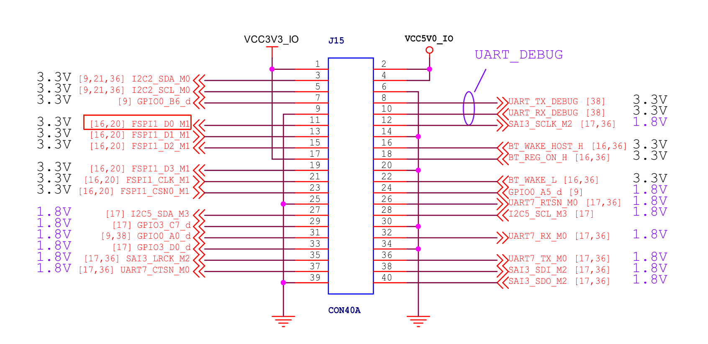

# 🌈 TuYa WS2812 移植指南

本指南将协助你在 **DshanPi-A1** 平台上完成 **WS2812** 全彩 LED 灯珠的驱动移植与测试。

:::tip 提示
本教程重点在于 **设备树 overlay 的使用** 以及 **驱动编译流程**。请确保按照步骤顺序执行。
:::

## 🛠️ 1. 搭建编译环境

在编译驱动程序之前，必须确保系统安装了与当前运行内核版本匹配的开发环境。

### 1.1 下载内核头文件

我们需要下载对应的 `deb` 包来安装内核头文件：

:::info 📥 资源下载
**点击下载**：[linux-headers-vendor-rk35xx...deb](https://dl.100ask.net/Hardware/MPU/RK3576-DshanPi-A1/linux-headers-vendor-rk35xx_25.11.0-trunk_arm64__6.1.115-S2482-D0b5d-P09c0-C2265H2313-HK01ba-Vc222-Bd200-R448a.deb)
:::

### 1.2 安装 Deb 包

下载完成后，执行以下指令进行安装：

```bash
sudo dpkg -i linux-headers-vendor-rk35xx_*.deb
```

:::warning 注意
具体 deb 包名以下载的版本为准，下载链接可能会实时更新，请核对文件名。
:::

<details>
  <summary>🔍 点击查看详细安装日志</summary>

```bash
meihao@dshanpi-a1:~/Downloads$ sudo dpkg -i linux-headers-vendor-rk35xx_25.11.0-trunk_arm64__6.1.115-S2482-D0b5d-P09c0-C2265H2313-HK01ba-Vc222-Bd200-R448a.deb
[sudo] password for meihao:
Selecting previously unselected package linux-headers-vendor-rk35xx.
(Reading database ... 156725 files and directories currently installed.)
Preparing to unpack linux-headers-vendor-rk35xx_25.11.0-trunk_arm64__6.1.115-S2482-D0b5d-P09c0-C2265H2313-HK01ba-Vc222-Bd200-R448a.deb ...
...
Done compiling kernel-headers (6.1.115-vendor-rk35xx).
Done compiling kernel-headers tools (6.1.115-vendor-rk35xx).
Armbian 'linux-headers-vendor-rk35xx' for '6.1.115-vendor-rk35xx': 'postinst' finishing.
```
</details>

安装完成后，系统会在 `/lib/modules/$(uname -r)/build` 建立一个指向内核头文件的符号链接。你可以通过以下命令检查：

```bash
ls /lib/modules/$(uname -r)/ -la
```

:::note 关键点
后续编译驱动程序时，需要在 `Makefile` 文件中指定这个 `build` 路径：
```bash
KDIR := /lib/modules/$(shell uname -r)/build
```
:::

---

## 🚀 2. 移植核心流程

本章节是移植的核心，包含了设备树的修改和驱动的编译。

:::info 📂 源码下载
我们准备了配套的设备树、驱动和应用程序文件，请点击下载：
**[点击此处下载](https://dl.100ask.net/Hardware/MPU/RK3576-DshanPi-A1/ws2812.tar.gz)**

文件列表：
- `Makefile`: 构建脚本
- `ws2812_app.c`: 测试应用程序
- `ws2812_drv.c`: 驱动源码
- `ws2812.dts`: 设备树 Overlay 文件
:::

### 2.1 🌳 添加 WS2812 设备树节点

在 Armbian 系统中，我们推荐使用 **Overlay** 的方式动态管理设备树节点，无需重新编译整个内核。

执行以下 **一键指令** 编译并安装 Device Tree Overlay：

```bash
sudo armbian-add-overlay ws2812.dts
```

:::tip ✅ 该命令自动完成的工作
1.  调用 `dtc` 编译器将 `.dts` 源码编译为二进制 `.dtbo` 文件。
2.  将生成的 `.dtbo` 复制到 `/boot/overlay-user/` 系统目录。
3.  自动更新 `/boot/armbianEnv.txt` 配置文件，添加 `user_overlays` 字段。
:::

**重启设备**后，请检查节点是否生效：

```bash
# 检查 UART4 是否已被禁用（因为引脚冲突）
ls /dev/ttyS4
# 预期输出: ls: cannot access '/dev/ttyS4': No such file or directory

# 检查 WS2812 节点是否存在
cat /sys/bus/spi/devices/spi2.0/of_node/compatible
# 预期输出: dshanpi-a1,ws2812
```

:::danger ⚠️ 引脚冲突警告
**UART4** 的引脚与 **WS2812** 使用的 SPI 引脚存在冲突，因此上述操作会自动禁用 UART4 节点。请确保你没有在使用 UART4 串口。
:::

### 2.2 🔨 编译驱动与应用程序

进入源码目录，执行 `make` 指令一键编译：

```bash
cd ~/kernel_modules/ws2812
make
```

编译成功后的输出如下：

```bash
make -C /lib/modules/6.1.115-vendor-rk35xx/build M=/home/meihao/kernel_modules/ws2812 modules
...
  LD [M]  /home/meihao/kernel_modules/ws2812/ws2812_drv.ko
cc ws2812_app.c -o ws2812_app
```

生成的关键文件：
*   `ws2812_drv.ko`: 驱动内核模块
*   `ws2812_app`: 用户态测试程序

---

## 💡 3. 上机实验

### 3.1 🔌 硬件连接

WS2812 的 **DI (Data Input)** 引脚需要连接到 DshanPi-A1 的 **SPI2_MOSI** 引脚（即 **11号引脚**）。



:::caution ⚡ 接线注意
*   **VCC**: 接 5V
*   **GND**: 接 GND
*   **DI**: 接 SPI2_MOSI (Pin 11)
*   **DO**: (可选) 级联下一个 WS2812
:::

### 3.2 📦 装载驱动模块

使用 `insmod` 命令将编译好的驱动加载到内核中：

```bash
sudo insmod ws2812_drv.ko
```

加载成功后，系统会生成设备节点 `/dev/ws2812-leds`：

```bash
ls /dev/ws2812-leds
```

### 3.3 ✨ 运行炫酷灯效

假设你连接了 **35** 颗灯珠，可以使用以下命令运行测试程序：

```bash
sudo ./ws2812_app 35
```

<details>
  <summary>📜 点击查看运行效果日志</summary>

```bash
meihao@dshanpi-a1:~/kernel_modules/ws2812$ sudo ./ws2812_app 35
WS2812 Application Started
Target Device: /dev/ws2812-leds
LED Number: 35
Starting color cycle... Press Ctrl+C to exit.
Color: Red
Color: Green
Color: Blue
Color: White
Effect: Running Light
...
^C
Exiting... Turning off LEDs.
```
</details>

