# TuyaAI 聊天机器人

参考链接：

- TuyaOpen：https://tuyaopen.ai/zh/docs/about-tuyaopen
- TuyaOpen仓库：https://github.com/tuya/TuyaOpen
- TuyaOpen仓库的ubuntu分支：[tuya/TuyaOpen at ed/ubuntu-alsa](https://github.com/tuya/TuyaOpen/tree/ed/ubuntu-alsa)

在万物智联的时代，语音交互正成为人与设备之间最自然、最高效的沟通方式。涂鸦智能推出的 TuyaOpen 框架，让开发者能够像搭积木一样，快速将 AI 语音能力嵌入任何 Linux 级硬件。本文所呈现的「TuyaAI 聊天机器人」实战项目，正是基于 TuyaOpen 在 RK3576 Ubuntu 平台上的完整落地样例——从领取云端授权、创建 AI 产品，到 ALSA 音频适配、源码裁剪编译，再到最终扫码配网，全程手把手，零基础也能复刻成功。

## 0.获取AI Key

- 领取授权码方式：https://platform.tuya.com/purchase/index?type=6

## 1.创建AI产品

进入涂鸦开发者平台：[涂鸦全球化智能平台开发者](https://auth.tuya.com/?from=https://www.tuya.com/redirect?url=https%3A%2F%2Fplatform.tuya.com)

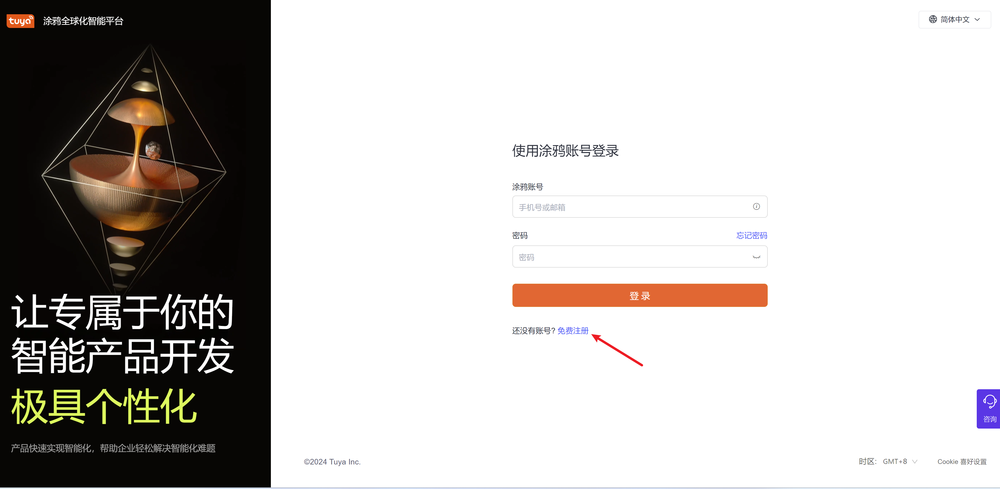

登录成功后，选择`AI产品`->`创建产品`。

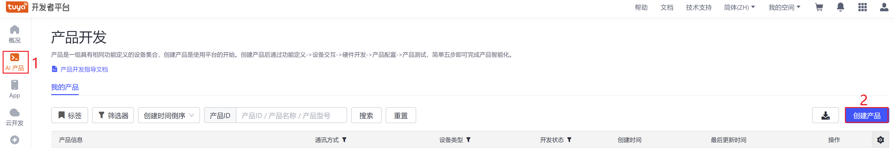

选择`其他`->`自定义AI硬件`

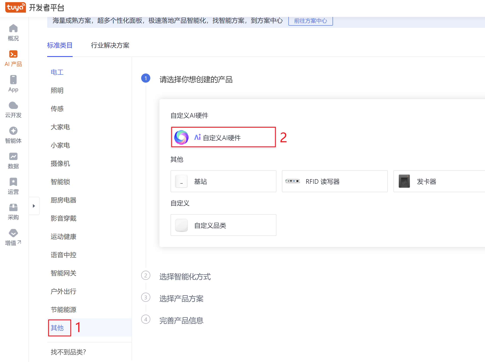

选择`产品开发`

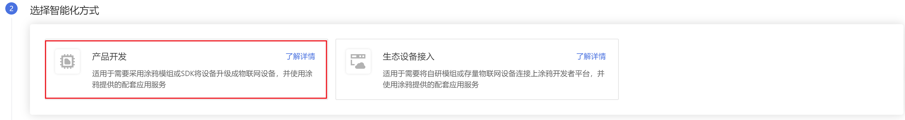

选择`AI硬件`，并填入产品名称（可自定义）等信息，填写完成后**创建产品**。

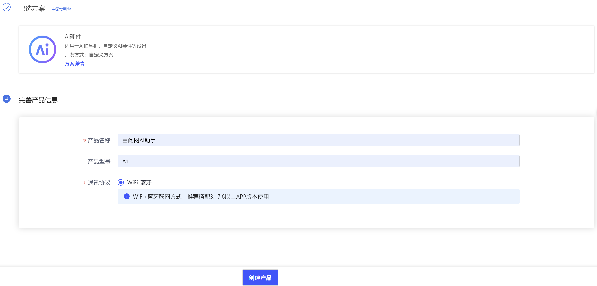

可选择音量作为已选功能。

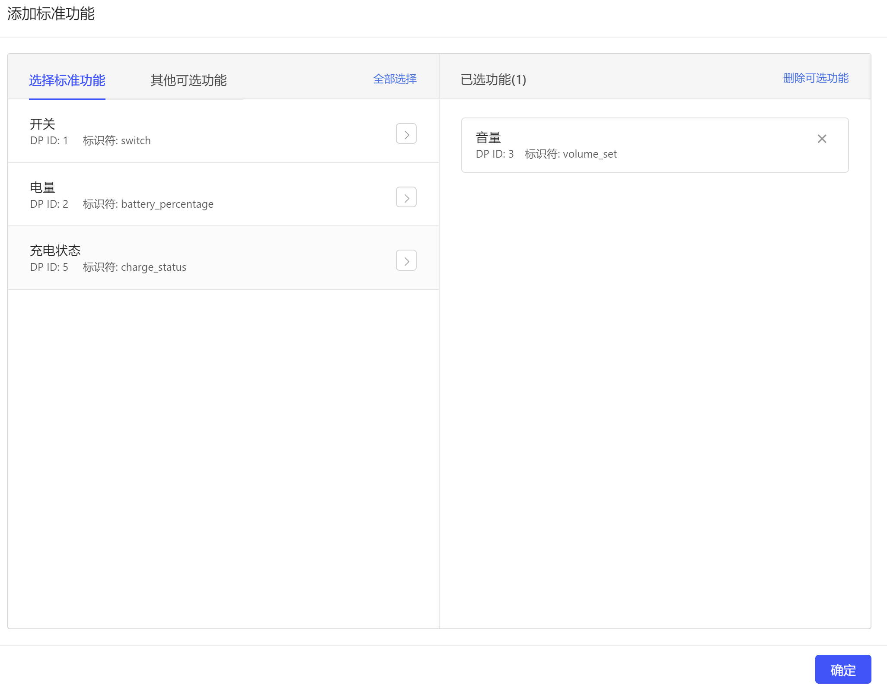

在产品功能下，找到产品高级功能，开启`扫码配网`：

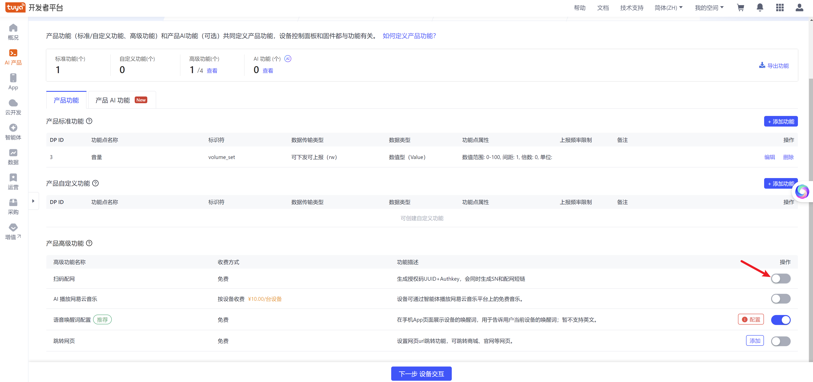

填入App ID，这里以中国大陆用户为例，填入`1233006116`，填写完成后点击确定。

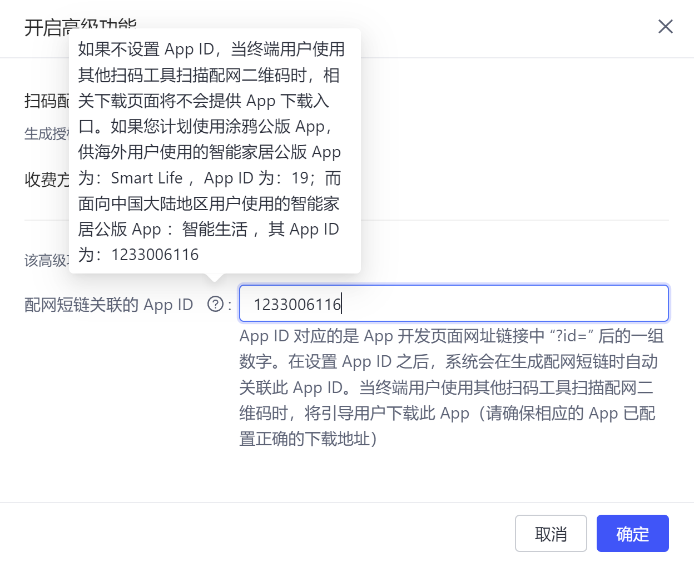

选择`下一步 设备交互`

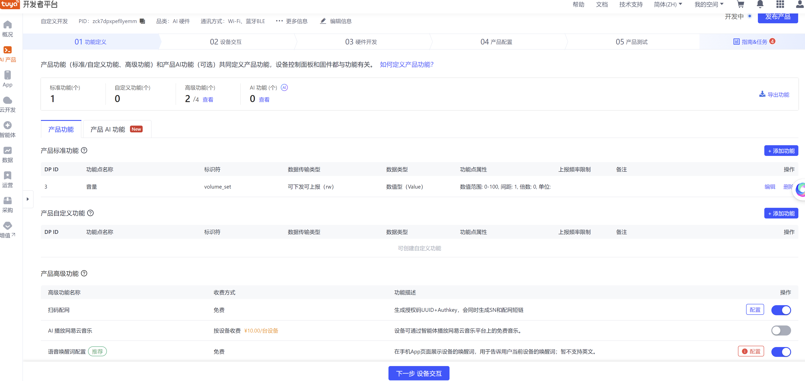

选择`下一步 硬件开发`

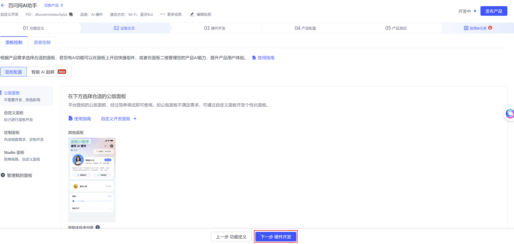

选择任意硬件：

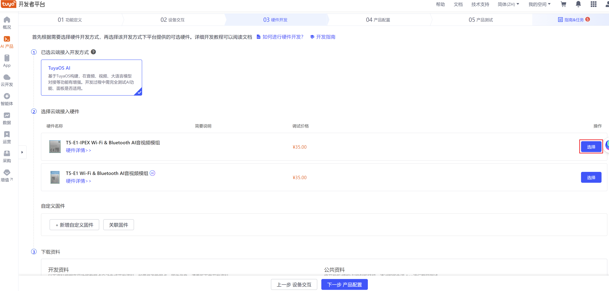

领取授权码：

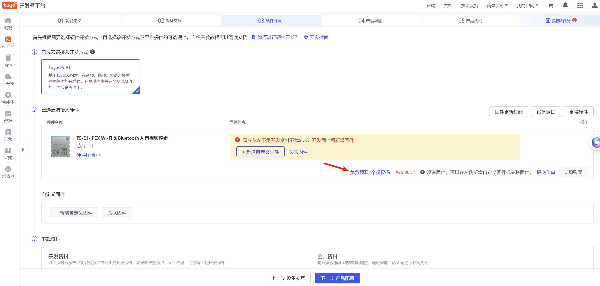

按照如下链接创建产品领取授权码：[领取授权码](https://developer.tuya.com/cn/docs/iot-device-dev/application-creation?id=Kbxw7ket3aujc#title-4-%E7%AC%AC%E4%BA%94%E6%AD%A5%EF%BC%9A%E9%A2%86%E5%8F%96%E6%8E%88%E6%9D%83%E7%A0%81)。

领取成功后，点击`下一步 产品配置`

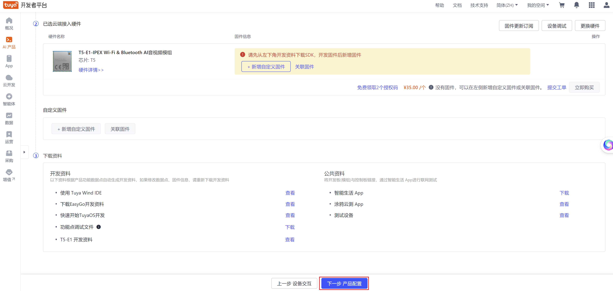

选择 `下一步 产品测试`

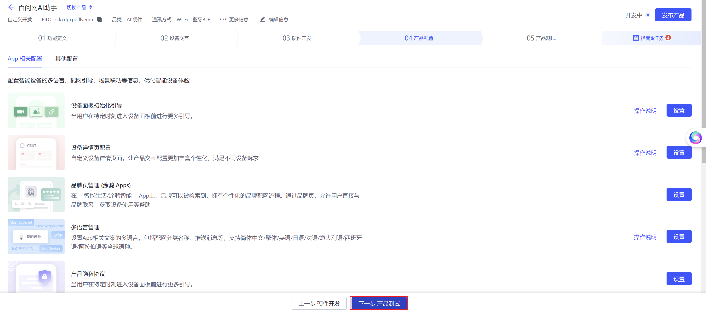

在该产品中申请的授权码，可以在下图所示位置查看：

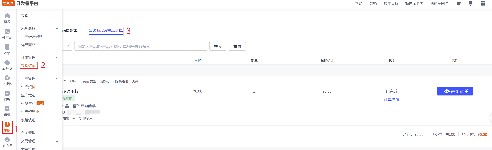

授权码和AI产品是对应的。请下载授权码清单获取UUID和Key，后续需要填入代码中。


## 2.适配ALSA库

如果没有安装alsa库，需执行：

```
sudo apt-get install libasound2-dev
```

由于DshanPI A1有两个声音播放设备耳机和喇叭，由于使用喇叭播放比较方便，下面以使用喇叭为例。新增喇叭播放设备。

```
sudo vi /etc/asound.conf
```

将下面的内容填入该文件中

```
pcm.speaker_r {
  type route
  slave.pcm "hw:0,0"
  slave.channels 2
  ttable.0.1 1
  ttable.1.1 0
  ttable.0.0 0
  ttable.1.0 0
}
```

## 3.项目编译

### 3.1 安装环境依赖

```
sudo apt-get install lcov cmake-curses-gui build-essential ninja-build wget git python3 python3-pip python3-venv libc6-i386 libsystemd-dev
```

### 3.2 下载 `TuyaOpen` 仓库

```
# 使用 github
git clone https://github.com/tuya/TuyaOpen.git

# 进入项目
cd TuyaOpen

#切换ubuntu分支
git fetch origin
git switch --track origin/ed/ubuntu-alsa
```


### 3.3 激活配置脚本

```
. ./export.sh
```

执行效果如下：

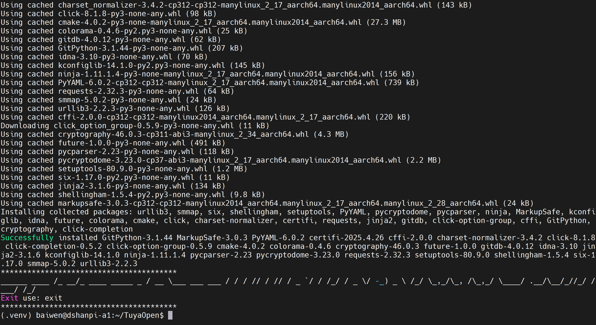

### 3.4 配置项目

进入AI聊天机器人目录：

```
cd apps/tuya.ai/your_chat_bot/
```

新增配置文件

```
#进入配置文件目录
cd config/

#拷贝ubuntu配置文件为新文件
cp Ubuntu.config DSHANPI_AI_RK3576_UBUNTU.config

#修改DSHANPI_AI_RK3576_UBUNTU.config
vi DSHANPI_AI_RK3576_UBUNTU.config
```

修改`DSHANPI_AI_RK3576_UBUNTU.config`配置文件中的录音设备和播音设备：

```
CONFIG_ALSA_DEVICE_CAPTURE="plughw:0,0"
CONFIG_ALSA_DEVICE_PLAYBACK="speaker_r"
```

修改完成后，回到`TuyaOpen/apps/tuya.ai/your_chat_bot`目录。

```
cd ..
```

使用命令 `tos.py config choice` 对项目进行配置。

```
tos.py config choice
```

运行后，选中DSHANPI_AI_RK3576_UBUNTU.config。

运行效果如下：

```
(.venv) baiwen@dshanpi-a1:~/chatBot/TuyaOpen/apps/tuya.ai/your_chat_bot$ tos.py config choice
[INFO]: Running tos.py ...
[NOTE]: Fullclean success.
--------------------
1. DNESP32S3.config
2. DNESP32S3_BOX.config
3. DNESP32S3_BOX2_WIFI.config
4. DSHANPI_AI_RK3576_UBUNTU.config
5. ESP32S3_BREAD_COMPACT_WIFI.config
6. T5AI_MINI_LCD_1.54.config
7. T5AI_MOJI_1.28.config
8. TUYA_T5AI_BOARD_LCD_3.5.config
9. TUYA_T5AI_BOARD_LCD_3.5_v101.config
10. TUYA_T5AI_CORE.config
11. TUYA_T5AI_EVB.config
12. Ubuntu.config
13. WAVESHARE_ESP32S3_TOUCH_AMOLED_1_8.config
14. WAVESHARE_T5AI_TOUCH_AMOLED_1_75.config
15. XINGZHI_ESP32S3_Cube_0_96OLED_WIFI.config
--------------------
Input "q" to exit.
Choice config file: 4
```

### 3.5 修改源码

**1.修改默认设备**

修改`TuyaOpen/boards/Ubuntu/board_com_api.c`程序文件

将原来的：

```
#if defined(CONFIG_ALSA_DEVICE_CAPTURE)
            strncpy(alsa_cfg.capture_device, CONFIG_ALSA_DEVICE_CAPTURE, sizeof(alsa_cfg.capture_device) - 1);
        #else
            strncpy(alsa_cfg.capture_device, "default", sizeof(alsa_cfg.capture_device) - 1);
        #endif

        #if defined(CONFIG_ALSA_DEVICE_PLAYBACK)
            strncpy(alsa_cfg.playback_device, CONFIG_ALSA_DEVICE_PLAYBACK, sizeof(alsa_cfg.playback_device) - 1);
        #else
            strncpy(alsa_cfg.playback_device, "default", sizeof(alsa_cfg.playback_device) - 1);

```

修改为：

```
#if defined(CONFIG_ALSA_DEVICE_CAPTURE)
            strncpy(alsa_cfg.capture_device, CONFIG_ALSA_DEVICE_CAPTURE, sizeof(alsa_cfg.capture_device) - 1);
        #else
            strncpy(alsa_cfg.capture_device, "plughw:0,0", sizeof(alsa_cfg.capture_device) - 1);
        #endif

        #if defined(CONFIG_ALSA_DEVICE_PLAYBACK)
            strncpy(alsa_cfg.playback_device, CONFIG_ALSA_DEVICE_PLAYBACK, sizeof(alsa_cfg.playback_device) - 1);
        #else
            strncpy(alsa_cfg.playback_device, "speaker_r", sizeof(alsa_cfg.playback_device) - 1);

```


**2.修改UUID和KEY**

修改源码`TuyaOpen/apps/tuya.ai/your_chat_bot/include/tuya_config.h`程序文件中的：

```
#define TUYA_OPENSDK_UUID    "uuidxxxxxxxxxxxxxxxx"             // Please change the correct uuid
#define TUYA_OPENSDK_AUTHKEY "keyxxxxxxxxxxxxxxxxxxxxxxxxxxxxx" // Please change the correct authkey
```

将获取的AI KEY填入即可。

### 3.6 编译程序

在终端输入以下命令：

```
tos.py build
```

运行效果如下：

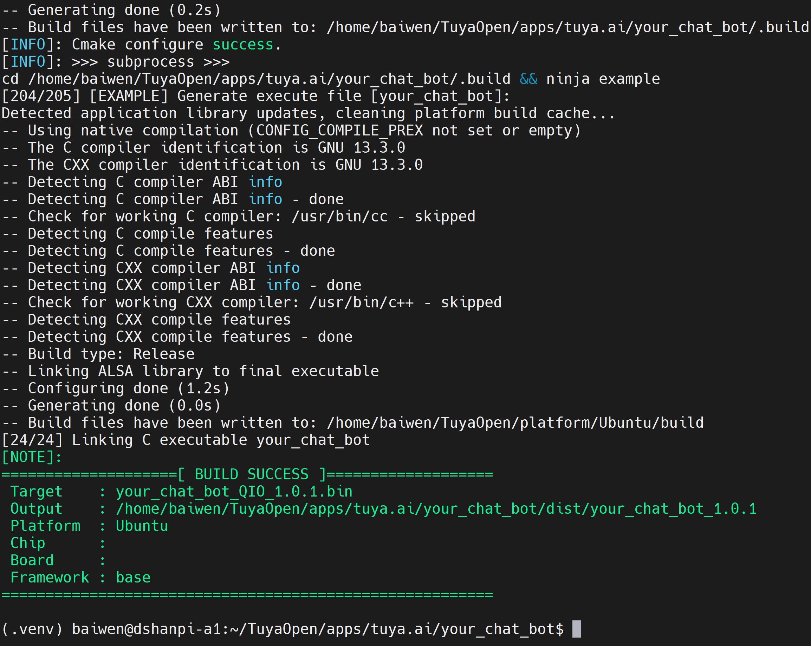

## 4.项目运行

在终端执行：

```
sudo ./dist/your_chat_bot_1.0.1/your_chat_bot_1.0.1.elf
```

运行成功后，需要使用软件扫码进行设备配网，访问[涂鸦APP](https://smartapp.tuya.com/tuyasmart/)下载APP,下载成功后，打开软件，使用扫一扫，扫描软件打印的二维码:

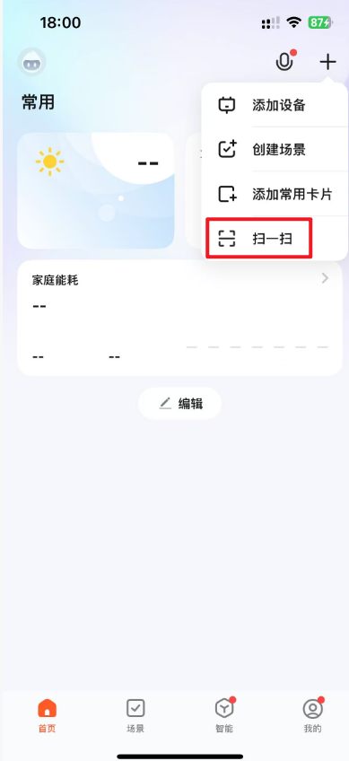

程序运行输出如下：

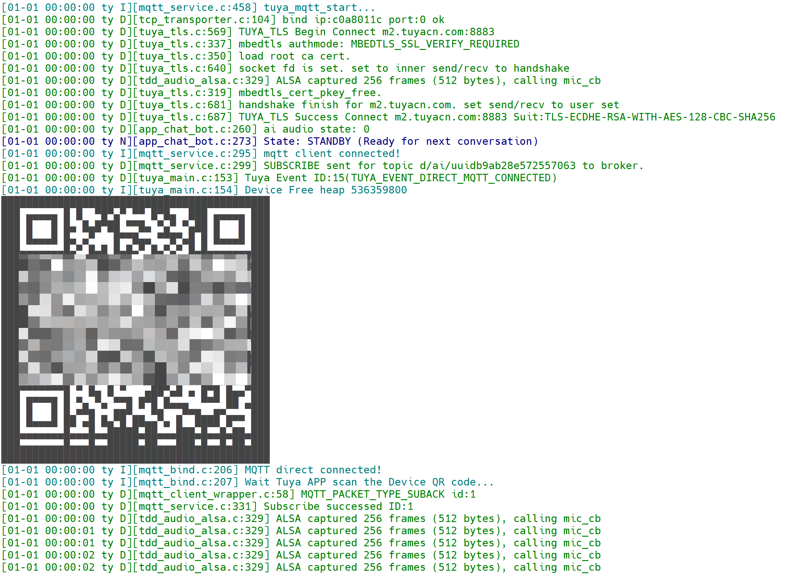

使用涂鸦APP扫描后，手机端进行角色切换和编辑。

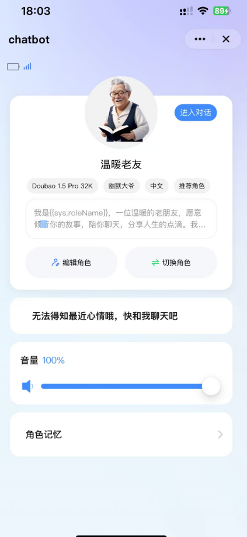

在软件运行终端可按下`s`开始聆听，按下`x`停止聆听。

```
Commands:
  [S] - Start listening
  [X] - Stop listening
  [V] - Volume up
  [D] - Volume down
  [Q] - Quit application
```

> 注意：目前暂时只支持单次对话，按下`s`开始对话后，对话完成需要按下`x`,再按下`s`才能继续对话！


## 5.源码分析

参考链接：

- [Tuya.ai聊天机器人](https://tuyaopen.ai/zh/docs/applications/tuya.ai/demo-your-chat-bot)

### 5.1 目录结构

```
.
├── app_default.config    # 应用默认配置文件
├── assets                # 静态资源目录
├── CMakeLists.txt        # CMake 构建脚本
├── config                # 硬件配置目录
├── include               # 头文件存放目录
├── Kconfig               # 项目配置文件
├── README_zh.md          # 中文说明文档
├── README.md             # 英文说明文档
├── script                # 脚本目录
└── src                   # 源码目录
```

对于`config`目录下，基于Linux平台参考使用的是`Ubuntu.config`，在该文件中，主要定义了`ALSA`输入输出设备、GUI、网络设备选择等信息。

```
baiwen@dshanpi-a1:~/TuyaOpen/apps/tuya.ai/your_chat_bot/config$ ls
DNESP32S3_BOX2_WIFI.config  ESP32S3_BREAD_COMPACT_WIFI.config  TUYA_T5AI_BOARD_LCD_3.5.config       TUYA_T5AI_EVB.config                       WAVESHARE_T5AI_TOUCH_AMOLED_1_75.config
DNESP32S3_BOX.config        T5AI_MINI_LCD_1.54.config          TUYA_T5AI_BOARD_LCD_3.5_v101.config  Ubuntu.config                              XINGZHI_ESP32S3_Cube_0_96OLED_WIFI.config
DNESP32S3.config            T5AI_MOJI_1.28.config              TUYA_T5AI_CORE.config                WAVESHARE_ESP32S3_TOUCH_AMOLED_1_8.config
```


对于`include`目录下，主要重点关注`tuya_config.h`。

```
baiwen@dshanpi-a1:~/TuyaOpen/apps/tuya.ai/your_chat_bot/include$ ls
app_chat_bot.h  #包含ALSA设备结构体，键盘事件输入头文件
app_display.h  #包括显示GUI相关函数
app_system_info.h  #系统相关函数
reset_netcfg.h  # 设备上下电重置功能头文件
tuya_config.h	# 设备授权码等信息配置 (此文件很重要，需要填入申请获取的AI Key)
```


对于核心源码目录：

```
baiwen@dshanpi-a1:~/TuyaOpen/apps/tuya.ai/your_chat_bot/src$ tree -L 2
.
├── app_chat_bot.c		# 聊天机器人功能实现
├── app_system_info.c	# 系统信息相关功能
├── display		# 显示界面模块
│   ├── app_display.c	# 显示模块主控制文件
│   ├── CMakeLists.txt	# 显示模块的 CMake 配置
│   ├── font			# 字体资源目录
│   ├── image			# 图片资源目录
│   ├── Kconfig			# 显示相关的配置选项
│   ├── tuya_lvgl.c		# LVGL 与应用的适配文件
│   ├── tuya_lvgl.h		# LVGL 与应用的适配头文件
│   └── ui				# UI 界面实现
├── media
│   ├── media_src_en.c
│   └── media_src_zh.c
├── reset_netcfg.c		# 设备上下电重置功能
└── tuya_main.c			# 应用入口
6 directories, 11 files
```


### 5.2 核心代码

` user_event_handler_on`事件回调函数，是 Tuya IoT SDK 的“事件总回调”。
 SDK 只要检测到有重要事件（比如开始配网、MQTT 连接或断开、OTA 升级通知、时间同步、收到 DP 下发等），就会调用这个函数，然后函数根据 event 的类型做对应处理。

调用的流程是：

1. SDK 里发生一个事件（例如设备刚连上云端）。
2. SDK 调用 user_event_handler_on，传进来当前客户端指针和事件结构。
3. 函数先打印日志（事件 ID 和当前剩余堆内存），然后用一个 switch 按事件类型分别处理。
4. 处理完直接返回，等下一次有新事件再被调用。

每次进来，这个函数都会做两件事：

1. 打印当前收到的 Tuya 事件 ID 和对应的字符串名称，用于调试。
2. 查询并打印当前设备空闲堆内存大小，方便你观察内存是否异常增长或泄露。

做完这两个通用动作，才进入具体事件的分支逻辑。

- 如果是配网开始，就判断要不要重启，并播“配网中”的提示音；
- 如果是点对点 MQTT 链接，就在串口上打印一个绑定二维码；
- 如果是正常 MQTT 连上云端，就通知其他模块、更新显示、播“已联网”提示音，并把当前音量同步给云端；
- 如果和云端断开，就通知其他模块“我掉线了”；
- 如果有 OTA 升级通知，就打印升级信息；
- 如果云端同步时间，就更新本地时钟；
- 如果有重置请求，就先打标记，等下次配网再重启；
- 如果收到对象型 DP（比如音量），就执行本地动作并把最新状态回报给云端；
- 如果收到 RAW 型 DP，就打印并示例性回一段数据；
- 其他事件目前先忽略。

```
void user_event_handler_on(tuya_iot_client_t *client, tuya_event_msg_t *event)
{
    PR_DEBUG("Tuya Event ID:%d(%s)", event->id, EVENT_ID2STR(event->id));
    PR_INFO("Device Free heap %d", tal_system_get_free_heap_size());

    switch (event->id) {
    case TUYA_EVENT_BIND_START:
        // 进入配网/绑定
        if (_need_reset == 1) tal_system_reset();
        ai_audio_player_play_alert(AI_AUDIO_ALERT_NETWORK_CFG);
        break;

    case TUYA_EVENT_DIRECT_MQTT_CONNECTED:
        // 点对点 MQTT 已连接，可以打印二维码
#if ENABLE_QRCODE
        sprintf(buffer, "https://smartapp.tuya.com/s/p?p=%s&uuid=%s&v=2.0",
                TUYA_PRODUCT_ID, license.uuid);
        qrcode_string_output(buffer, user_log_output_cb, 0);
#endif
        break;

    case TUYA_EVENT_MQTT_CONNECTED:
        // 云端在线
        tal_event_publish(EVENT_MQTT_CONNECTED, NULL);
        static uint8_t first = 1;
        if (first) {
            first = 0;
#if ENABLE_CHAT_DISPLAY
            // 显示“网络良好”
            UI_WIFI_STATUS_E wifi_status = UI_WIFI_STATUS_GOOD;
            app_display_send_msg(TY_DISPLAY_TP_NETWORK,
                                 (uint8_t *)&wifi_status, sizeof(UI_WIFI_STATUS_E));
#endif
            ai_audio_player_play_alert(AI_AUDIO_ALERT_NETWORK_CONNECTED);
            ai_audio_volume_upload();  // 把当前音量同步到云端
        }
        break;

    case TUYA_EVENT_MQTT_DISCONNECT:
        // 云端掉线
        tal_event_publish(EVENT_MQTT_DISCONNECTED, NULL);
        break;

    case TUYA_EVENT_UPGRADE_NOTIFY:
        user_upgrade_notify_on(client, event->value.asJSON);
        break;

    case TUYA_EVENT_TIMESTAMP_SYNC:
        // 云端时间同步
        tal_time_set_posix(event->value.asInteger, 1);
        break;

    case TUYA_EVENT_RESET:
        // 用户请求重置，先标记，等 BIND_START 时真正 reset
        _need_reset = 1;
        break;

    case TUYA_EVENT_DP_RECEIVE_OBJ: {
        dp_obj_recv_t *dpobj = event->value.dpobj;
        audio_dp_obj_proc(dpobj);  // 处理音量等 DP
        tuya_iot_dp_obj_report(client, dpobj->devid, dpobj->dps, dpobj->dpscnt, 0); // 回 ACK
    } break;

    case TUYA_EVENT_DP_RECEIVE_RAW: {
        dp_raw_recv_t *dpraw = event->value.dpraw;
        // 打印 RAW DP 数据
        // 然后 tuya_iot_dp_raw_report 回传（这里举例用 len=3）
        tuya_iot_dp_raw_report(client, dpraw->devid, &dpraw->dp, 3);
    } break;

    default:
        break;
    }
}
```


**整个应用的“总入口”和“上电初始化流程”**。它做完所有初始化后，就进入一个无限循环，持续和 Tuya 云交互。

- 初始化基础库和 Tuya 平台组件
- 读取设备身份 
-  创建并配置 Tuya IoT 客户端（含事件回调和网络检测）
- 初始化网络栈和配网方式 
- 注册板级硬件 
- 初始化 Chat Bot 业务 
- 打印系统信息 
-  启动 IoT 主任务和网络 
- 检查是否要进入配网 
-  进入无限循环，不断让客户端与云端交互并处理事件。

```
void user_main(void)
{
    int ret = OPRT_OK;

    // 1) 基础库初始化：cJSON hook、日志
    cJSON_InitHooks(&(cJSON_Hooks){.malloc_fn = tal_malloc, .free_fn = tal_free});
    tal_log_init(TAL_LOG_LEVEL_DEBUG, 1024, (TAL_LOG_OUTPUT_CB)tkl_log_output);

    // 打印项目信息（项目名、版本、编译时间、平台等）

    // 2) 各种 Tuya 平台基础组件
    tal_kv_init(...);           // KV 存储
    tal_sw_timer_init();        // 软件定时器
    tal_workq_init();           // 工作队列
    tal_time_service_init();    // 时间服务
    tal_cli_init();             // 命令行
    tuya_authorize_init();      // 授权组件初始化

    reset_netconfig_start();    // 进入“配网重置检测”流程

    // 3) 读取设备 license（uuid/authkey）
    if (OPRT_OK != tuya_authorize_read(&license)) {
        // 读不到就用默认的宏 TUYA_OPENSDK_UUID / AUTHKEY，提示你去云平台申请
        license.uuid = TUYA_OPENSDK_UUID;
        license.authkey = TUYA_OPENSDK_AUTHKEY;
    }

    // 4) 初始化 Tuya IOT 客户端
    ret = tuya_iot_init(&ai_client, &(const tuya_iot_config_t){
        .software_ver = PROJECT_VERSION,
        .productkey   = TUYA_PRODUCT_ID,
        .uuid         = license.uuid,
        .authkey      = license.authkey,
        .event_handler = user_event_handler_on, // 绑定事件回调
        .network_check = user_network_check,    // 绑定网络检测函数
    });
    assert(ret == OPRT_OK);

    // 5) 如果使用 LwIP，则初始化协议栈
#if ENABLE_LIBLWIP
    TUYA_LwIP_Init();
#endif

    // 6) 初始化网络管理器 netmgr
    netmgr_type_e type = 0;
#if ENABLE_WIFI
    type |= NETCONN_WIFI;
#endif
#if ENABLE_WIRED
    type |= NETCONN_WIRED;
#endif
    netmgr_init(type);

#if ENABLE_WIFI
    // WiFi 配网方式设置（这里用 Tuya BLE 配网）
    netmgr_conn_set(NETCONN_WIFI, NETCONN_CMD_NETCFG,
                    &(netcfg_args_t){.type = NETCFG_TUYA_BLE});
#endif

    // 7) 注册板级硬件（按键、LED、音频编解码、功放等）
    ret = board_register_hardware();
    // 8) 初始化 Chat Bot 应用（录音、播放、AI 逻辑等）
    ret = app_chat_bot_init();

    // 9) 打印系统信息（例如内存、版本等）
    app_system_info();

    // 10) 启动 Tuya IOT 主任务（内部会起 MQTT 等线程）
    tuya_iot_start(&ai_client);

    // 11) WiFi 低功耗模式配置（这里关掉）
    tkl_wifi_set_lp_mode(0, 0);

    // 12) 检查是否需要进入配网模式
    reset_netconfig_check();

    // 13) 主循环：处理云端事件、心跳、重连等
    for (;;) {
        tuya_iot_yield(&ai_client);
    }
}

```

1. 初始化基础库（JSON 内存钩子 + 日志系统）

- 把 cJSON 的内存分配函数重定向到 Tuya 自己的 `tal_malloc` / `tal_free`，这样后面所有 JSON 解析释放都走统一内存管理。
- 初始化 Tuya 的日志模块，设置日志级别（调试级）、缓存大小、以及最终输出函数（例如串口输出）。
   → 目的：后面所有 PR_DEBUG / PR_INFO / PR_ERR 都能正常工作，并且内存管理统一。

------

2. 初始化 Tuya 通用基础组件

依次初始化几大基础服务：

- KV 存储：提供“键值对持久化存储”，后面配网信息、授权信息、配置等都可以存在这里。
- 软件定时器：提供“软定时任务”的基础能力。
- 工作队列：支持把任务投递到后台线程异步执行。
- 时间服务：统一管理系统时间（后面云端同步时间会用到）。
- CLI 命令行：在串口或终端里可以敲命令调试。
- 授权组件：管理设备 UUID、AuthKey 等授权信息，从 KV 里读写。

这一段就是把“系统框架”的骨架先全部搭起来。

------

3. 启动配网重置检测流程

- 调用一个“配网重置检测”的起始函数，它一般会：
  - 检查是否有按键长按等触发“恢复出厂/重新配网”的条件；
  - 如果需要，后面会进入对应的配网模式（例如快连、蓝牙配网等）。

这一步相当于在启动阶段就挂上“我要不要重置网络配置”的观察逻辑。

------

4. 读取设备 License（UUID / AuthKey）

- 尝试从授权存储中读取设备的 license 信息（uuid 和 authkey）。
- 如果读取成功：说明设备已经烧过合法的身份信息，就直接使用这个。
- 如果读取失败：退回到编译时的默认宏（开放 SDK 自带的测试 uuid/authkey），并打印警告，提示你需要去 Tuya 云平台申请正式的身份信息。

这一块是“设备身份”的来源，没有 uuid/authkey 就没法连云。

------

5. 初始化 Tuya IoT 客户端（核心）

- 用前面拿到的软件版本、产品 ID（product key）、uuid、authkey，创建并初始化一个 Tuya IoT 客户端对象。
- 在这个初始化时，同时把两个“回调/接口”绑定进去：
  - 事件回调：也就是你前面分析过的 `user_event_handler_on`，以后所有云端/网络事件都会从这里进来。
  - 网络检测函数：用来让 SDK 定期检查当前网络是否可用。
- 初始化返回值用断言检查，确保这里一定成功；如果失败，说明基础环境有问题，程序不应该继续跑。

可以把这一步理解为：**“向 Tuya 云注册一个客户端 + 告诉 SDK，我这边怎么处理事件、如何检查网络”**。

------

6. 初始化网络协议栈（可选 LwIP）

- 如果工程配置中启用了 LwIP，则在这里初始化 IP 协议栈。
- 对于 Linux/带系统的场景，可以不用 LwIP，走系统自己的网络栈，所以这一步是可选。

这一步就是为后续的 TCP/IP 通信（尤其在无操作系统或轻量系统平台上）准备基础。

------

7. 初始化网络管理器 netmgr（Wi-Fi/有线）

- 先根据编译宏判断：当前工程是否启用了 Wi-Fi、是否启用了有线网络。
- 用一个类型标志把启用的网络类型拼出来，然后初始化网络管理器。
  - 如果只开了 Wi-Fi，就只初始化 Wi-Fi 通路。
  - 如果只开了有线，就只初始化有线。
  - 都开，就两个都管。

接着：

- 如果启用了 Wi-Fi，再进一步配置 Wi-Fi 的“配网方式”，这里指定的是“Tuya BLE 配网”——也就是说后面对 Wi-Fi 的账号密码获取，是通过蓝牙引导的方式来完成。

这一块整体就是“把网络接口都拉起来，并配置好配网策略”。

------

8. 注册板级硬件（board_register_hardware）

- 把当前硬件板子上用到的各种外设注册并初始化，例如：
  - 按键、LED 灯；
  - 音频编解码器、功放；
  - 麦克风、扬声器；
  - 其他 GPIO、SPI、I2C 设备等。

这一步是“让软件真正认识板子上的具体硬件资源”，后面的业务模块才可以调用。

------

9. 初始化 Chat Bot 应用（app_chat_bot_init）

- 初始化你自己的业务逻辑——这里就是 Chat Bot：
  - 配置音频采集/播放；
  - 建立和 AI 模型或云端语音能力的对接；
  - 各种内部状态机、缓冲队列等。
- 如果初始化失败，会打印错误日志，方便你定位语音/AI 部分的问题。

这一步是“业务层”的启动：有了它，设备才具备具体的“语音聊天机器人”能力，而不仅是一个空壳 IoT 终端。

------

10. 打印系统信息（app_system_info）

- 把当前系统的一些运行信息打印出来，比如：
  - 内存情况；
  - 版本号；
  - 编译信息；
  - 各种配置开关。
- 主要目的是调试和运维时快速看到设备当前状态。

这一块属于“自检和信息展示”，不直接影响功能，但非常有用。

------

11. 启动 Tuya IoT 主任务（tuya_iot_start）

- 调用 Tuya 的启动接口，正式让 IoT 客户端跑起来。
- 通常会在内部创建一些线程/任务，用于：
  - 和云端建立及维持 MQTT 连接；
  - 处理心跳包；
  - 接收云端下发的数据、触发事件回调；
  - 做必要的重连和维护。

可以把这一步看成：**“按下电源键，让‘云端通信引擎’开始工作”**。

------

12. 配置 Wi-Fi 低功耗模式（tkl_wifi_set_lp_mode）

- 设置 Wi-Fi 的低功耗模式参数，当前代码是把低功耗关掉：
  - 第一参数为 0，表示不启用低功耗；
  - 第二参数为 0，模式配置为默认。
- 对某些场景，你可能会改成开启低功耗以省电。

这一块主要针对电池设备/功耗优化场景，这里示例是优先保证通信稳定性，不省电。

------

13. 再次检查配网状态（reset_netconfig_check）

- 在完成一轮初始化后，再检查一次是否需要进入配网流程。
- 根据这个检测结果，可能会进入特定的“配网模式”（比如重新开始 BLE 配网、热点配网等）或保持现状。

这一步是前面“配网重置流程”的收尾，确保上电/重置后的设备能根据当前状态选择合适的网络配置模式。

------

14. 进入主循环（tuya_iot_yield）

- 进入一个无限循环。
- 在循环体内不停地调用 Tuya 的“让客户端跑一小步”的接口：
  - 处理收发数据；
  - 维持心跳；
  - 触发与事件相关的回调（例如你之前看的 user_event_handler_on）；
  - 做必要的重连或后台任务。

这就是整个程序的“主循环”：
 **初始化全部完成 → 启动 IoT 客户端 → 持续在循环里“喂”客户端，让它始终在线并处理各种事件。**
