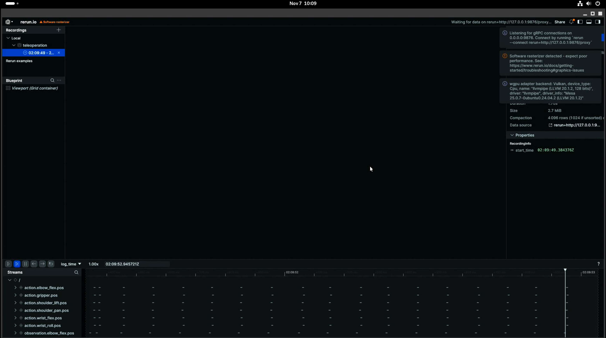
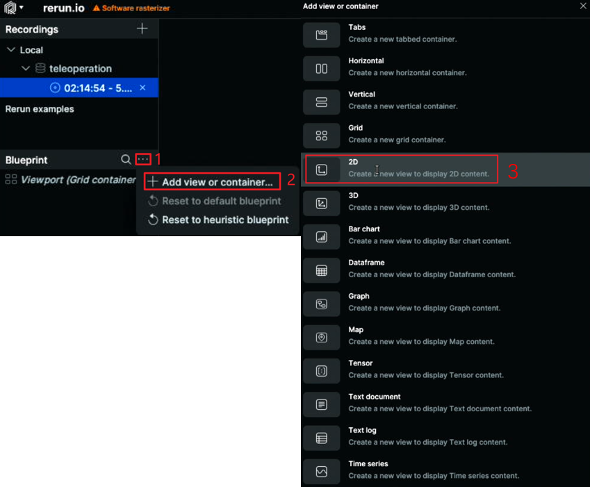
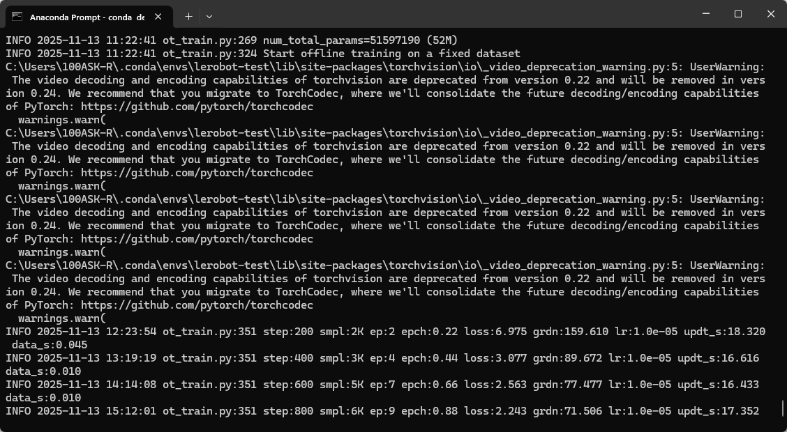
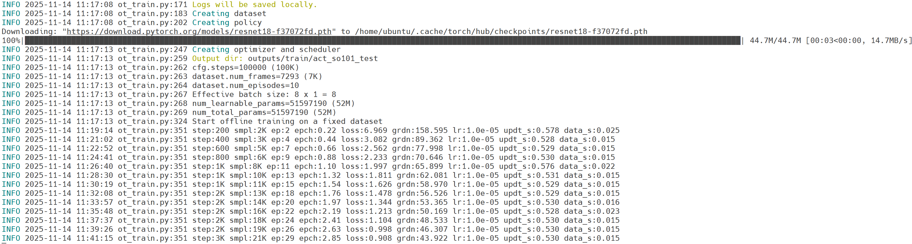
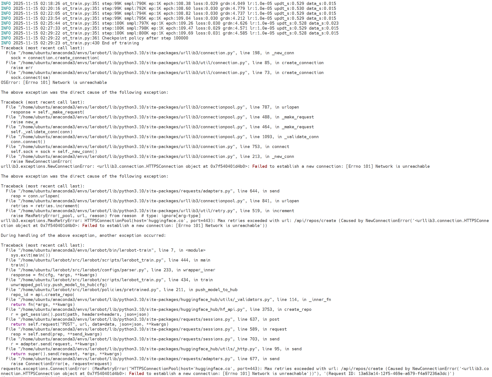
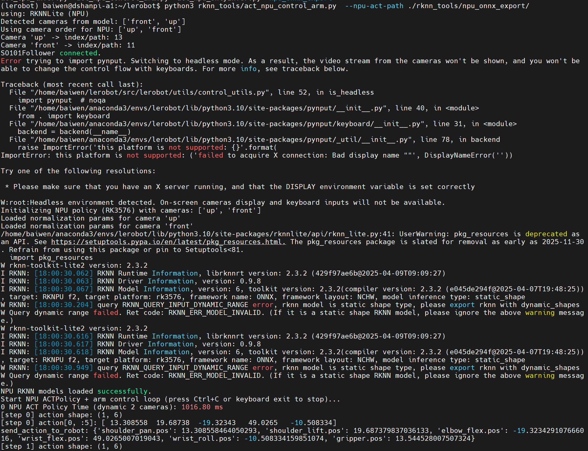

# 具身智能机械臂

## 1.端侧环境搭建

### 1.1 创建虚拟环境

使用 Python 3.10 创建一个虚拟环境并激活它，例如使用 [`miniforge`](https://conda-forge.org/download/)：

```
conda create -y -n lerobot python=3.10
conda activate lerobot
```

使用 时，在您的环境中安装：`conda``ffmpeg`

```
conda install ffmpeg -c conda-forge
```

> **注意：**这通常适用于使用编码器编译的平台。如果不受支持（检查支持的编码器 ），您可以：`ffmpeg 7.X``libsvtav1``libsvtav1``ffmpeg -encoders`
>
> - *[在任何平台上]*使用以下方式显式安装：`ffmpeg 7.X`
>
> ```
> conda install ffmpeg=7.1.1 -c conda-forge
> ```
>
> - *[仅限 Linux]*使用 [libsvtav1 安装](https://trac.ffmpeg.org/wiki/CompilationGuide/Ubuntu#libsvtav1) [ffmpeg 构建依赖项](https://trac.ffmpeg.org/wiki/CompilationGuide/Ubuntu#GettheDependencies)并从源代码编译 ffmpeg，并确保使用 .`which ffmpeg`

### 1.2 安装 LeRobot

克隆存储库并进入源码目录：

```
git clone -b v0.4.0 https://github.com/huggingface/lerobot.git
cd lerobot
```

以可编辑模式安装库：

```
pip install -e .
```

**从 PyPI 安装：**

```
pip install lerobot
```

**额外功能：**若要安装其他功能，请使用以下选项之一：

```
pip install 'lerobot[all]'          # All available features
pip install 'lerobot[aloha,pusht]'  # Specific features (Aloha & Pusht)
pip install 'lerobot[feetech]'      # Feetech motor support
```

*将 `[...]` 替换为所需的功能。*

> 对于 lerobot 0.4.0，如果您想安装 libero 或 pi，您必须执行以下作：`pip install "lerobot[pi,libero]@git+https://github.com/huggingface/lerobot.git"`

**故障 排除**

如果遇到构建错误，可能需要安装其他依赖项：、 和 。 要为 Linux 安装这些，请运行：`cmake``build-essential``ffmpeg libs`

```
sudo apt-get install cmake build-essential python-dev pkg-config libavformat-dev libavcodec-dev libavdevice-dev libavutil-dev libswscale-dev libswresample-dev libavfilter-dev pkg-config
```

对于其他系统，请参阅：[编译 PyAV](https://pyav.org/docs/develop/overview/installation.html#bring-your-own-ffmpeg)


### 1.3 可选依赖项

LeRobot 为特定功能提供可选的附加功能。可以组合多个附加功能（例如，）。有关所有可用的附加功能，请参阅 。`.[aloha,feetech]``pyproject.toml`

**模拟**

安装环境包：（[gym-aloha](https://github.com/huggingface/gym-aloha)） 或 （[gym-pusht](https://github.com/huggingface/gym-pusht)） 例：`aloha``pusht`

```
pip install -e ".[aloha]" # or "[pusht]" for example
```

**电机控制**

对于 Koch v1.1，请安装 Dynamixel SDK，对于 SO100/SO101/Moss，请安装 Feetech SDK。

```
pip install -e ".[feetech]" # or "[dynamixel]" for example
```

**实验跟踪**

要使用[权重和偏差](https://docs.wandb.ai/quickstart)进行实验跟踪，请使用

```
wandb login
```

如果机器人尚未准备好，您现在可以组装机器人，请在左侧查找您的机器人类型。然后点击下面的链接将 Lerobot 与您的机器人一起使用。


安装GPU基础库。

```
sudo apt update
sudo apt install -y libvulkan1 vulkan-tools mesa-vulkan-drivers mesa-utils
```


## 2.舵机适配

Lerobot官方文档参考：[SO-101](https://huggingface.co/docs/lerobot/so101)

### 2.1 查找舵机控制器

开始前请安装好舵机，并将舵机控制器连接至DshanPI A1开发板的USB口中。执行如下命令：

```
lerobot-find-port
```

运行效果：

```
(lerobot) baiwen@dshanpi-a1:~/lerobot$ lerobot-find-port
Finding all available ports for the MotorsBus.
Ports before disconnecting: ['/dev/ttyACM0', '/dev/ttyS7', '/dev/ttyS4', '/dev/tty63', '/dev/tty62', '/dev/tty61', '/dev/tty60', '/dev/tty59', '/dev/tty58', '/dev/tty57', '/dev/tty56', '/dev/tty55', '/dev/tty54', '/dev/tty53', '/dev/tty52', '/dev/tty51', '/dev/tty50', '/dev/tty49', '/dev/tty48', '/dev/tty47', '/dev/tty46', '/dev/tty45', '/dev/tty44', '/dev/tty43', '/dev/tty42', '/dev/tty41', '/dev/tty40', '/dev/tty39', '/dev/tty38', '/dev/tty37', '/dev/tty36', '/dev/tty35', '/dev/tty34', '/dev/tty33', '/dev/tty32', '/dev/tty31', '/dev/tty30', '/dev/tty29', '/dev/tty28', '/dev/tty27', '/dev/tty26', '/dev/tty25', '/dev/tty24', '/dev/tty23', '/dev/tty22', '/dev/tty21', '/dev/tty20', '/dev/tty19', '/dev/tty18', '/dev/tty17', '/dev/tty16', '/dev/tty15', '/dev/tty14', '/dev/tty13', '/dev/tty12', '/dev/tty11', '/dev/tty10', '/dev/tty9', '/dev/tty8', '/dev/tty7', '/dev/tty6', '/dev/tty5', '/dev/tty4', '/dev/tty3', '/dev/tty2', '/dev/tty1', '/dev/tty0', '/dev/tty', '/dev/ttyFIQ0']
Remove the USB cable from your MotorsBus and press Enter when done.

#此时将舵机控制器的USB断开，再按下回车键。
The port of this MotorsBus is '/dev/ttyACM0'
Reconnect the USB cable.
```

可以看到`/dev/ttyACM0`，该设备为串行总线舵机控制器的设备号。

### 2.2 设置舵机 ID 和波特率

设置设备访问权限：

```
sudo chmod 666 /dev/ttyACM*
```

当舵机为全新时，舵机一般都会带有默认ID，为了让舵机和舵机控制器之间可以正常工作，控制器和所有电机配置相同的波特率。

使用控制器单独链接每个点击，将参数写入电机内部存储器中。

```
lerobot-setup-motors \
    --robot.type=so101_follower \
    --robot.port=/dev/ttyACM0
```

参考如下视频：[Lerobot官方文档 Setup motors video](https://huggingface.co/datasets/huggingface/documentation-images/resolve/main/lerobot/setup_motors_so101_2.mp4)

对于主动臂设置如下：

```
lerobot-setup-motors \
    --teleop.type=so101_leader \
    --teleop.port=/dev/ttyACM1  #请确保主动臂的设备号
```


### 2.2 校准机械臂

校准从动臂：

```
lerobot-calibrate \
    --robot.type=so101_follower \
    --robot.port=/dev/ttyACM0 \
    --robot.id=my_awesome_follower_arm
```

参考如下视频：[Lerobot官方文档 Calibration video](https://huggingface.co/datasets/huggingface/documentation-images/resolve/main/lerobot/calibrate_so101_2.mp4)

对于校准主动臂：

```
lerobot-calibrate \
	--teleop.type=so101_leader \
    --teleop.port=/dev/ttyACM1 \
    --teleop.id=my_awesome_leader_arm
```


### 2.3 遥控机械臂

在终端执行以下命令，操作主臂时，从动臂也会跟随移动。

```
lerobot-teleoperate \
    --robot.type=so101_follower \
    --robot.port=/dev/ttyACM0 \
    --robot.id=my_awesome_follower_arm \
    --teleop.type=so101_leader \
    --teleop.port=/dev/ttyACM1 \
    --teleop.id=my_awesome_leader_arm
```


## 3.拓展相机

### 3.1 查找摄像头

查找插入DshanPI A1的摄像机的摄像机索引，运行以下命令：

```
lerobot-find-cameras opencv
```

输出内容如下：

```
(lerobot) baiwen@dshanpi-a1:~/lerobot$ lerobot-find-cameras opencv
--- Detected Cameras ---
Camera #0:
  Name: OpenCV Camera @ /dev/video0
  Type: OpenCV
  Id: /dev/video0
  Backend api: V4L2
  Default stream profile:
    Format: 0.0
    Fourcc: YV12
    Width: 64
    Height: 64
    Fps: -1.0
--------------------
Camera #1:
  Name: OpenCV Camera @ /dev/video1
  Type: OpenCV
  Id: /dev/video1
  Backend api: V4L2
  Default stream profile:
    Format: 0.0
    Fourcc: YV12
    Width: 64
    Height: 64
    Fps: -1.0
--------------------
Camera #2:
  Name: OpenCV Camera @ /dev/video10
  Type: OpenCV
  Id: /dev/video10
  Backend api: V4L2
  Default stream profile:
    Format: 0.0
    Fourcc: YV12
    Width: 64
    Height: 64
    Fps: -1.0
--------------------
Camera #3:
  Name: OpenCV Camera @ /dev/video11
  Type: OpenCV
  Id: /dev/video11
  Backend api: V4L2
  Default stream profile:
    Format: 0.0
    Fourcc: YUYV
    Width: 640
    Height: 480
    Fps: 30.0
--------------------
(more cameras ...)
Finalizing image saving...
Image capture finished. Images saved to outputs/captured_images
```

由于板载了HDMI IN，也会出现设备节点在其中，你可以通过拔插USB摄像头确定设备号，我这里使用的是`/dev/video11`。可以在`outputs/captured_images`目录下，看到拍摄的图片`opencv__dev_video11.png`。

```
(lerobot) baiwen@dshanpi-a1:~/lerobot/outputs/captured_images$ ls
opencv__dev_video11.png
```


### 3.2 使用摄像头

新建程序文件`UseCameras.py`，填入以下内容：

```
from lerobot.cameras.opencv.configuration_opencv import OpenCVCameraConfig
from lerobot.cameras.opencv.camera_opencv import OpenCVCamera
from lerobot.cameras.configs import ColorMode, Cv2Rotation

# Construct an `OpenCVCameraConfig` with your desired FPS, resolution, color mode, and rotation.
config = OpenCVCameraConfig(
    index_or_path=11,
    fps=30,
    width=1920,
    height=1080,
    color_mode=ColorMode.RGB,
    rotation=Cv2Rotation.NO_ROTATION,
    fourcc="MJPG"
)

# Instantiate and connect an `OpenCVCamera`, performing a warm-up read (default).
camera = OpenCVCamera(config)
camera.connect()

# Read frames asynchronously in a loop via `async_read(timeout_ms)`
try:
    for i in range(10):
        frame = camera.async_read(timeout_ms=200)
        print(f"Async frame {i} shape:", frame.shape)
finally:
    camera.disconnect()
```

运行效果：

```
(lerobot) baiwen@dshanpi-a1:~/lerobot/outputs/captured_images$ python3 UseCameras.py
Async frame 0 shape: (1920, 1080, 3)
Async frame 1 shape: (1920, 1080, 3)
Async frame 2 shape: (1920, 1080, 3)
Async frame 3 shape: (1920, 1080, 3)
Async frame 4 shape: (1920, 1080, 3)
Async frame 5 shape: (1920, 1080, 3)
.......
```


**FAQ:**

**1.RuntimeError: OpenCVCamera(11) failed to set fps=15 (actual_fps=10.0).**

具体报错：

```
(lerobot) baiwen@dshanpi-a1:~/lerobot/outputs/captured_images$ python3 UseCameras.py
Traceback (most recent call last):
  File "/home/baiwen/lerobot/outputs/captured_images/UseCameras.py", line 17, in <module>
    camera.connect()
  File "/home/baiwen/lerobot/src/lerobot/cameras/opencv/camera_opencv.py", line 172, in connect
    self._configure_capture_settings()
  File "/home/baiwen/lerobot/src/lerobot/cameras/opencv/camera_opencv.py", line 226, in _configure_capture_settings
    self._validate_fps()
  File "/home/baiwen/lerobot/src/lerobot/cameras/opencv/camera_opencv.py", line 241, in _validate_fps
    raise RuntimeError(f"{self} failed to set fps={self.fps} ({actual_fps=}).")
RuntimeError: OpenCVCamera(11) failed to set fps=5 (actual_fps=10.0).
```

解决办法：修改代码中`fps=15`为`fps=15`。

**2.TimeoutError: Timed out waiting for frame from camera OpenCVCamera(11) after 200 ms. Read thread alive: True.**

具体报错：

```
(lerobot) baiwen@dshanpi-a1:~/lerobot/outputs/captured_images$ python3 UseCameras.py
Async frame 0 shape: (1080, 1920, 3)
Traceback (most recent call last):
  File "/home/baiwen/lerobot/outputs/captured_images/UseCameras.py", line 22, in <module>
    frame = camera.async_read(timeout_ms=200)
  File "/home/baiwen/lerobot/src/lerobot/cameras/opencv/camera_opencv.py", line 507, in async_read
    raise TimeoutError(
TimeoutError: Timed out waiting for frame from camera OpenCVCamera(11) after 200 ms. Read thread alive: True.
```

解决办法：降低图像分辨率，将代码中的 `width=1920`和`height=1080`修改为： `width=1280`和`height=720`。


## 4.可视化摄像头和机械臂

安装Dynamixel库，用于伺服电机进行通信，在终端执行：

```
pip install dynamixel-sdk
```

可视化摄像头并实现遥控机械臂，在终端执行：

```
lerobot-teleoperate \
    --robot.type=so101_follower  \
    --robot.port=/dev/ttyACM0 \
    --robot.id=my_awesome_follower_arm \
    --robot.cameras="{ front: {type: opencv, index_or_path: 11, width: 1920, height: 1080, fps: 30, fourcc: "MJPG"}}" \
    --teleop.type=so101_leader  \
    --teleop.port=/dev/ttyACM1 \
    --teleop.id=my_awesome_leader_arm \
    --display_data=true
```

如果需要调整分辨率和帧率可修改`cameras`中的参数：

```
lerobot-teleoperate \
    --robot.type=so101_follower  \
    --robot.port=/dev/ttyACM0 \
    --robot.id=my_awesome_follower_arm \
    --robot.cameras="{ front: {type: opencv, index_or_path: 11, width: 640, height: 480, fps: 30, fourcc: "MJPG"}}" \
    --teleop.type=so101_leader  \
    --teleop.port=/dev/ttyACM1 \
    --teleop.id=my_awesome_leader_arm \
    --display_data=true
```


> 注意：**使用 CPU 软渲染 + CPU 解码相机**，两头吃力就会卡。把显示和解码负载降下来，立刻就顺畅很多。ji即修改参数--display_data=false


执行完成后，会启动如下画面：



如果想看到摄像头的画面，需要找到`Blueprint`选项框的`...`，选择其中的`Add View or container`后，选择`2D`。如下所示：



选择完成后可在界面中看到摄像头实时预览画面。


## 5.主机端环境搭建

### 5.1 环境搭建

由于我们需要采集数据进行训练，需要用到NVIDIA GPU，所以建议在主机端搭建环境采集数据。

```
git clone https://github.com/100askTeam/lerobot.git
```


使用 Python 3.10 创建一个虚拟环境并激活它，例如使用 [`miniforge`](https://conda-forge.org/download/)：

```
conda create -y -n lerobot python=3.10
conda activate lerobot
```

使用时，在您的环境中安装：`conda``ffmpeg`

```
conda install ffmpeg -c conda-forge
```

> **注意：**这通常适用于使用编码器编译的平台。如果不受支持（检查支持的编码器 ），您可以：`ffmpeg 7.X``libsvtav1``libsvtav1``ffmpeg -encoders`
>
> - *[在任何平台上]*使用以下方式显式安装：`ffmpeg 7.X`
>
> ```
> conda install ffmpeg=7.1.1 -c conda-forge
> ```
>
> - *[仅限 Linux]*使用 [libsvtav1 安装](https://trac.ffmpeg.org/wiki/CompilationGuide/Ubuntu#libsvtav1) [ffmpeg 构建依赖项](https://trac.ffmpeg.org/wiki/CompilationGuide/Ubuntu#GettheDependencies)并从源代码编译 ffmpeg，并确保使用 .`which ffmpeg`


单独安装pytorch和cuda：

```
pip install torch==2.7.1 torchvision==0.22.1 torchaudio==2.7.1 --index-url https://download.pytorch.org/whl/cu126
```


进入源码目录：

```
cd lerobot
```

以可编辑模式安装库：

```
pip install -e .
```

**从 PyPI 安装：**

```
pip install lerobot
```

**额外功能：**若要安装其他功能，请使用以下选项之一：

```
pip install -e ".[aloha, pusht, xarm]"  # Specific features (Aloha & Pusht)
pip install -e ".[feetech]"      # Feetech motor support
pip install -e ".[all]" 
```

*将 `[...]` 替换为所需的功能。*

> 对于 lerobot 0.4.0，如果您想安装 libero 或 pi，您必须执行以下作：`pip install "lerobot[pi,libero]@git+https://github.com/huggingface/lerobot.git"`

**故障 排除**

如果遇到构建错误，可能需要安装其他依赖项。 要为 Linux 安装这些，请运行：`cmake``build-essential``ffmpeg libs`

```
sudo apt-get install cmake build-essential python-dev pkg-config libavformat-dev libavcodec-dev libavdevice-dev libavutil-dev libswscale-dev libswresample-dev libavfilter-dev pkg-config
```

对于其他系统，请参阅：[编译 PyAV](https://pyav.org/docs/develop/overview/installation.html#bring-your-own-ffmpeg)


### 5.2 检查配置

开始前请安装好舵机，并将舵机控制器连接至DshanPI A1开发板的USB口中。执行如下命令：

```
lerobot-find-port
```

运行效果：

```
(lerobot) D:\Programmers\Robot\lerobot>lerobot-find-port
Finding all available ports for the MotorsBus.
Ports before disconnecting: ['COM1', 'COM8', 'COM13']
Remove the USB cable from your MotorsBus and press Enter when done.

#此时将舵机控制器的USB断开，再按下回车键。
The port of this MotorsBus is 'COM8'
Reconnect the USB cable.
```

这里我通过命令获取从动臂为`COM8`、主动臂`COM13`。


校准从动臂：

```
lerobot-calibrate --robot.type=so101_follower --robot.port=COM8 --robot.id=my_awesome_follower_arm
```

对于校准主动臂：

```
lerobot-calibrate --teleop.type=so101_leader --teleop.port=COM13 --teleop.id=my_awesome_leader_arm
```


在终端执行以下命令，操作主臂时，从动臂也会跟随移动。

```
lerobot-teleoperate --robot.type=so101_follower --robot.port=COM8 --robot.id=my_awesome_follower_arm --teleop.type=so101_leader --teleop.port=COM13 --teleop.id=my_awesome_leader_arm
```

查看摄像头

```
lerobot-find-cameras opencv
```

这里我通过查看，发现摄像头ID为`0`。

使用单个摄像头：

```
lerobot-teleoperate --robot.type=so101_follower  --robot.port=COM8    --robot.id=my_awesome_follower_arm     --robot.cameras="{ up: {type: opencv, index_or_path: 0, width: 1920, height: 1080, fps: 30, fourcc: "MJPG"}}" --teleop.type=so101_leader  --teleop.port=COM13 --teleop.id=my_awesome_leader_arm --display_data=true
```

使用两个摄像头：

```
lerobot-teleoperate --robot.type=so101_follower  --robot.port=COM8    --robot.id=my_awesome_follower_arm     --robot.cameras="{ up: {type: opencv, index_or_path: 0, width: 1280, height: 720, fps: 30, fourcc: "MJPG"},front: {type: opencv, index_or_path: 1, width: 1280, height: 720, fps: 30, fourcc: "MJPG"}}" --teleop.type=so101_leader  --teleop.port=COM13 --teleop.id=my_awesome_leader_arm --display_data=true
```


## 5.采集数据集

记录10组数据：

```
lerobot-record --robot.type=so101_follower --robot.port=COM8 --robot.id=my_awesome_follower_arm --robot.cameras="{ up: {type: opencv, index_or_path: 0, width: 640, height: 480, fps: 30, fourcc: "MJPG"},front: {type: opencv, index_or_path: 1, width: 640, height: 480, fps: 30, fourcc: "MJPG"}}" --teleop.type=so101_leader --teleop.port=COM13 --teleop.id=my_awesome_leader_arm --display_data=true --dataset.repo_id=baiwen/record-test --dataset.num_episodes=10 --dataset.single_task="Grab the green cube"
```

其中按下左箭头`→`即可完整录制进入下一步骤，重复录制数据，重置环境10次后即可。最后程序会自动上传到`huggingface.co`，由于网络问题，我们不变上传，会提示如下报错：

```
requests.exceptions.ConnectTimeout: (MaxRetryError("HTTPSConnectionPool(host='huggingface.co', port=443): Max retries exceeded with url: /api/repos/create (Caused by ConnectTimeoutError(<urllib3.connection.HTTPSConnection object at 0x0000025E2EDD8EB0>, 'Connection to huggingface.co timed out. (connect timeout=None)'))"), '(Request ID: bc41c711-2ba1-41be-9539-c4113ce0e165)')
```

此报错不影响，我们不上传数据，数据也会保存在我们的本地。


重播数据集：

```
lerobot-replay --robot.type=so101_follower --robot.port=COM8 --robot.id=my_awesome_follower_arm --dataset.repo_id=baiwen/record-test --dataset.episode=0
```

其中`--dataset.episode=0`为重播第0组数据，如果像重播其他数据修改最后的参数`0`，为对应的组即可。


可视化数据集：

```
lerobot-dataset-viz --repo-id baiwen/record-test --episode-index 0
```


## 6.在主机训练模型

使用带NVIDIA GPU的主机进行本地训练：

```
lerobot-train --dataset.repo_id=baiwen/record-test --policy.type=act --output_dir=outputs/train/act_so101_test --job_name=act_so101_test --policy.device=cuda --wandb.enable=false --policy.repo_id=baiwen/my_policy --dataset.push_to_hub=false --policy.push_to_hub=false
```

训练时间较长，在3060的8G Windows主机上训练ACT的10组数据的时间大概为8小时。运行效果如下： 

当然建议大家使用使用云平台GPU进行训练，训练时间更短，只需将程序上传云平台即可。如下所示：



训练到最后程序会自动上传到`huggingface`，但由于我们没有注册账号且无法连接到`huggingface`网站，会提示如下报错：


此报错不影响训练，模型已经训练完毕。


模型评估：

```
lerobot-record --robot.type=so100_follower --robot.port=COM8 --robot.cameras="{ up: {type: opencv, index_or_path: 0, width: 640, height: 480, fps: 30, fourcc: "MJPG"},front: {type: opencv, index_or_path: 1, width: 640, height: 480, fps: 30, fourcc: "MJPG"}}" --robot.id=my_awesome_follower_arm --display_data=true --dataset.num_episodes=10 --dataset.repo_id=baiwen/eval_so101  --dataset.single_task="Put lego brick into the transparent box" --policy.path=outputs\train\act_so101_test\checkpoints\100000\pretrained_model --dataset.push_to_hub=false
```


## 7.模型转换

获取模型转换工具：

```
git clone https://github.com/100askTeam/rk_lerobot_tools.git
```

将工具源码`rk_lerobot_tools`拷贝至lerobot_目录下：

```
baiwen@dshanpi-a1:~$ cp rk_lerobot_tools/ lerobot/ -rf
```


### 7.1 ONNX模型转换

安装ONNX:

```
pip install onnx onnxsim termcolor
```

执行模型转换：

```
python rk_lerobot_tools/export_act_onnx.py --dataset.repo_id=baiwen/record-test --policy.type=act   --policy.device=cpu --policy.repo_id=baiwen/eval_so101_act_export --wandb.enable=false
```

执行完成后可以在`npu_onnx_export`目录下看到导出的ONNX模型。

```
.
|-- NPU_ACTPolicy_TransformerLayers
|   `-- NPU_ACTPolicy_TransformerLayers.onnx
|-- NPU_ACTPolicy_VisionEncoder
|   `-- NPU_ACTPolicy_VisionEncoder.onnx
|-- new_actions.npy
`-- npu_output
3 directories, 3 files
```


### 7.2  RKNN模型转换

将`npu_onnx_export`文件夹拷贝至RKNN模型转换环境中，如下所示：

```
(base) baiwen@dshanpi-a1:~/lerobot/rk_lerobot_tools$ tree
.
├── convert_act_onnx_to_rknn.py
└── npu_onnx_export
    ├── new_actions.npy
    ├── NPU_ACTPolicy_TransformerLayers
    │   └── NPU_ACTPolicy_TransformerLayers.onnx
    ├── NPU_ACTPolicy_VisionEncoder
    │   └── NPU_ACTPolicy_VisionEncoder.onnx
    └── npu_output

5 directories, 6 files
```

激活rknn模型转换环境：

```
conda activate rknn-toolkit2
```

执行模型转换程序：

```
python3 convert_act_onnx_to_rknn.py
```

运行效果如下：

```
(rknn-toolkit2) baiwen@dshanpi-a1:~/lerobot/rk_lerobot_tools$ python3 convert_act_onnx_to_rknn.py
=================================================
ONNX -> RKNN
  ONNX : npu_onnx_export/NPU_ACTPolicy_VisionEncoder/NPU_ACTPolicy_VisionEncoder.onnx
  RKNN : npu_onnx_export/NPU_ACTPolicy_VisionEncoder.rknn
=================================================
I rknn-toolkit2 version: 2.3.2
--> Config RKNN
--> Loading ONNX model
I Loading : 100%|█████████████████████████████████████████████████| 62/62 [00:00<00:00, 2569.56it/s]
W load_onnx: The config.mean_values is None, zeros will be set for input 0!
W load_onnx: The config.std_values is None, ones will be set for input 0!
   Load ONNX done
--> Building RKNN without quantization (float)
I OpFusing 0: 100%|██████████████████████████████████████████████| 100/100 [00:00<00:00, 303.69it/s]
I OpFusing 1 : 100%|█████████████████████████████████████████████| 100/100 [00:00<00:00, 266.35it/s]
I OpFusing 2 : 100%|██████████████████████████████████████████████| 100/100 [00:07<00:00, 12.58it/s]
I rknn building ...
I rknn building done.
   Build RKNN done
--> Export RKNN
   Export RKNN done: npu_onnx_export/NPU_ACTPolicy_VisionEncoder.rknn
=================================================

=================================================
ONNX -> RKNN
  ONNX : npu_onnx_export/NPU_ACTPolicy_TransformerLayers/NPU_ACTPolicy_TransformerLayers.onnx
  RKNN : npu_onnx_export/NPU_ACTPolicy_TransformerLayers.rknn
=================================================
I rknn-toolkit2 version: 2.3.2
--> Config RKNN
--> Loading ONNX model
I Loading : 100%|█████████████████████████████████████████████████| 98/98 [00:00<00:00, 1351.41it/s]
W load_onnx: The config.mean_values is None, zeros will be set for input 0!
W load_onnx: The config.std_values is None, ones will be set for input 0!
W load_onnx: The config.mean_values is None, zeros will be set for input 1!
W load_onnx: The config.std_values is None, ones will be set for input 1!
W load_onnx: The config.mean_values is None, zeros will be set for input 2!
W load_onnx: The config.std_values is None, ones will be set for input 2!
   Load ONNX done
--> Building RKNN without quantization (float)
I OpFusing 0: 100%|███████████████████████████████████████████████| 100/100 [00:02<00:00, 46.12it/s]
I OpFusing 1 : 100%|██████████████████████████████████████████████| 100/100 [00:04<00:00, 22.27it/s]
I OpFusing 0 : 100%|██████████████████████████████████████████████| 100/100 [00:10<00:00,  9.86it/s]
I OpFusing 1 : 100%|██████████████████████████████████████████████| 100/100 [00:10<00:00,  9.68it/s]
I OpFusing 0 : 100%|██████████████████████████████████████████████| 100/100 [00:12<00:00,  7.95it/s]
I OpFusing 1 : 100%|██████████████████████████████████████████████| 100/100 [00:12<00:00,  7.92it/s]
I OpFusing 2 : 100%|██████████████████████████████████████████████| 100/100 [00:12<00:00,  7.83it/s]
I OpFusing 0 : 100%|██████████████████████████████████████████████| 100/100 [00:13<00:00,  7.29it/s]
I OpFusing 1 : 100%|██████████████████████████████████████████████| 100/100 [00:13<00:00,  7.25it/s]
I OpFusing 2 : 100%|██████████████████████████████████████████████| 100/100 [00:28<00:00,  3.49it/s]
I rknn building ...
I rknn building done.
   Build RKNN done
--> Export RKNN
   Export RKNN done: npu_onnx_export/NPU_ACTPolicy_TransformerLayers.rknn
=================================================

All RKNN models build success.
```

转换完成后，可以在`npu_onnx_export`目录下，看到转换完成的rknn模型。

```
(rknn-toolkit2) baiwen@dshanpi-a1:~/lerobot/rk_lerobot_tools$ ls npu_onnx_export/
new_actions.npy                  NPU_ACTPolicy_TransformerLayers.rknn  NPU_ACTPolicy_VisionEncoder.rknn
NPU_ACTPolicy_TransformerLayers  NPU_ACTPolicy_VisionEncoder           npu_output
```


## 8.端侧部署推理

 将转换生成的RKNN模型传输至板端的`lerobot/rk_lerobot_tools`目录下

```
baiwen@dshanpi-a1:~/lerobot/rk_lerobot_tools$ tree
.
├── act_cpu_infer.py
├── act_npu_control_arm.py
├── act_npu_OnlyInfer.py
└── npu_onnx_export
    ├── new_actions.npy
    ├── NPU_ACTPolicy_TransformerLayers
    │   ├── NPU_ACTPolicy_TransformerLayers.onnx
    │   └── NPU_ACTPolicy_TransformerLayers.rknn
    ├── NPU_ACTPolicy_VisionEncoder
    │   ├── NPU_ACTPolicy_VisionEncoder.onnx
    │   └── NPU_ACTPolicy_VisionEncoder.rknn
    └── npu_output
        ├── action_mean_unnormalize.npy
        ├── action_std_unnormalize.npy
        ├── front_mean.npy
        ├── front_std.npy
        ├── state_mean.npy
        ├── state_std.npy
        ├── up_mean.npy
        └── up_std.npy
5 directories, 16 files
```


将摄像头、舵机控制器连接至板端，连接完成后，运行端侧推理程序：

```
conda activate lerobot

#执行程序前可能需要提前安装rknn依赖，这里以python10版本为例，如果其他版本请安装其他版本的rknn推理库
cd ~/Projects/rknn-toolkit2/rknn-toolkit-lite2/packages
pip install rknn_toolkit_lite2-2.3.2-cp310-cp310-manylinux_2_17_aarch64.manylinux2014_aarch64.whl

#进入lerobot目录
cd ~/lerobot

#执行
python3 rk_lerobot_tools/act_npu_control_arm.py  --npu-act-path ./rk_lerobot_tools/npu_onnx_export/
```

运行效果如下：




## 【拓展】YOLOV8-POSE实现跟随

- 获取YOLOV8-POSE模型：[v8.2.0](https://github.com/ultralytics/assets/releases/download/v8.2.0/yolov8n-pose.pt)

### 1.ONNX模型导出

```
from ultralytics import YOLO

# 加载模型
model = YOLO('yolov8n-pose.pt')

# 进行预测并自动保存结果图片
results = model.predict(
    source='./bus.jpg', 
    save=True, 
    conf=0.5, 
    show_labels=True,
    show_conf=True
)

model.export(
    format='onnx',
    imgsz=320, 
    dynamic=True,
    simplify=True
)
```


固定输入尺寸：

```
python -m onnxsim yolov8n-pose.onnx yolov8n-pose_320_static.onnx --input-shape 1,3,320,320
```

### 2.RKNN模型转换

```
import sys,os
from rknn.api import RKNN

DATASET_PATH = '../../../datasets/COCO/coco_subset_20.txt'
DEFAULT_RKNN_PATH = '../model/yolov8_pose.rknn'
DEFAULT_QUANT = True

def parse_arg():
    if len(sys.argv) < 3:
        print("Usage: python3 {} onnx_model_path [platform] [dtype(optional)] [output_rknn_path(optional)]".format(sys.argv[0]));
        print("       platform choose from [rk3562, rk3566, rk3568, rk3576, rk3588, rv1126b]")
        print("       dtype choose from [i8] for [rk3562, rk3566, rk3568, rk3576, rk3588, rv1126b]")
        exit(1)

    model_path = sys.argv[1]
    platform = sys.argv[2]

    do_quant = DEFAULT_QUANT
    if len(sys.argv) > 3:
        model_type = sys.argv[3]
        if model_type not in ['i8', 'u8', 'fp']:
            print("ERROR: Invalid model type: {}".format(model_type))
            exit(1)
        elif model_type in ['i8', 'u8']:
            do_quant = True
        else:
            do_quant = False

    if len(sys.argv) > 4:
        output_path = sys.argv[4]
    else:
        output_path = DEFAULT_RKNN_PATH

    return model_path, platform, do_quant, output_path

if __name__ == '__main__':
    model_path, platform, do_quant, output_path = parse_arg()

    # Create RKNN object
    rknn = RKNN(verbose=False)

    # Pre-process config
    print('--> Config model')

    rknn.config(mean_values=[[0, 0, 0]], std_values=[
                    [255, 255, 255]], target_platform=platform)
    print('done')

    # Load model
    print('--> Loading model')
    ret = rknn.load_onnx(model=model_path)
    if ret != 0:
        print('Load model failed!')
        exit(ret)
    print('done')

    # Build model
    print('--> Building model')
    if platform in ["rv1109","rv1126","rk1808"] :
        ret = rknn.build(do_quantization=do_quant, dataset=DATASET_PATH, auto_hybrid_quant=True)
    else:
        if do_quant:
            rknn.hybrid_quantization_step1(
                dataset=DATASET_PATH,
                proposal= False,
                custom_hybrid=[['/model.22/cv4.0/cv4.0.0/act/Mul_output_0','/model.22/Concat_6_output_0'],
                                ['/model.22/cv4.1/cv4.1.0/act/Mul_output_0','/model.22/Concat_6_output_0'],
                                ['/model.22/cv4.2/cv4.2.0/act/Mul_output_0','/model.22/Concat_6_output_0']]
            )

            model_name=os.path.basename(model_path).replace('.onnx','')
            rknn.hybrid_quantization_step2(
                model_input = model_name+".model",          # 表示第一步生成的模型文件
                data_input= model_name+".data",             # 表示第一步生成的配置文件
                model_quantization_cfg=model_name+".quantization.cfg"  # 表示第一步生成的量化配置文件
            )
        else:
            ret = rknn.build(do_quantization=do_quant, dataset=DATASET_PATH)
    if ret != 0:
        print('Build model failed!')
        exit(ret)
    print('done')

    # Export rknn model
    print('--> Export rknn model')
    ret = rknn.export_rknn(output_path)
    if ret != 0:
        print('Export rknn model failed!')
        exit(ret)
    print("output_path:",output_path)
    print('done')
    # Release
    rknn.release()
```


程序运行：

```
python3 convert.py ../model/yolov8n-pose.onnx rk3576
```


### 3.端侧模型推理

```
import os
import sys
import urllib
import urllib.request
import time
import numpy as np
import argparse
import cv2,math
from math import ceil

#from rknn.api import RKNN
from rknnlite.api import RKNNLite as RKNN

CLASSES = ['person']

nmsThresh = 0.4
objectThresh = 0.5

def letterbox_resize(image, size, bg_color):
    """
    letterbox_resize the image according to the specified size
    :param image: input image, which can be a NumPy array or file path
    :param size: target size (width, height)
    :param bg_color: background filling data 
    :return: processed image
    """
    if isinstance(image, str):
        image = cv2.imread(image)

    target_width, target_height = size
    image_height, image_width, _ = image.shape

    # Calculate the adjusted image size
    aspect_ratio = min(target_width / image_width, target_height / image_height)
    new_width = int(image_width * aspect_ratio)
    new_height = int(image_height * aspect_ratio)

    # Use cv2.resize() for proportional scaling
    image = cv2.resize(image, (new_width, new_height), interpolation=cv2.INTER_AREA)

    # Create a new canvas and fill it
    result_image = np.ones((target_height, target_width, 3), dtype=np.uint8) * bg_color
    offset_x = (target_width - new_width) // 2
    offset_y = (target_height - new_height) // 2
    result_image[offset_y:offset_y + new_height, offset_x:offset_x + new_width] = image
    return result_image, aspect_ratio, offset_x, offset_y


class DetectBox:
    def __init__(self, classId, score, xmin, ymin, xmax, ymax, keypoint):
        self.classId = classId
        self.score = score
        self.xmin = xmin
        self.ymin = ymin
        self.xmax = xmax
        self.ymax = ymax
        self.keypoint = keypoint

def IOU(xmin1, ymin1, xmax1, ymax1, xmin2, ymin2, xmax2, ymax2):
    xmin = max(xmin1, xmin2)
    ymin = max(ymin1, ymin2)
    xmax = min(xmax1, xmax2)
    ymax = min(ymax1, ymax2)

    innerWidth = xmax - xmin
    innerHeight = ymax - ymin

    innerWidth = innerWidth if innerWidth > 0 else 0
    innerHeight = innerHeight if innerHeight > 0 else 0

    innerArea = innerWidth * innerHeight

    area1 = (xmax1 - xmin1) * (ymax1 - ymin1)
    area2 = (xmax2 - xmin2) * (ymax2 - ymin2)

    total = area1 + area2 - innerArea

    return innerArea / total


def NMS(detectResult):
    predBoxs = []

    sort_detectboxs = sorted(detectResult, key=lambda x: x.score, reverse=True)

    for i in range(len(sort_detectboxs)):
        xmin1 = sort_detectboxs[i].xmin
        ymin1 = sort_detectboxs[i].ymin
        xmax1 = sort_detectboxs[i].xmax
        ymax1 = sort_detectboxs[i].ymax
        classId = sort_detectboxs[i].classId

        if sort_detectboxs[i].classId != -1:
            predBoxs.append(sort_detectboxs[i])
            for j in range(i + 1, len(sort_detectboxs), 1):
                if classId == sort_detectboxs[j].classId:
                    xmin2 = sort_detectboxs[j].xmin
                    ymin2 = sort_detectboxs[j].ymin
                    xmax2 = sort_detectboxs[j].xmax
                    ymax2 = sort_detectboxs[j].ymax
                    iou = IOU(xmin1, ymin1, xmax1, ymax1, xmin2, ymin2, xmax2, ymax2)
                    if iou > nmsThresh:
                        sort_detectboxs[j].classId = -1
    return predBoxs


def sigmoid(x):
    return 1 / (1 + np.exp(-x))

def softmax(x, axis=-1):
    # 将输入向量减去最大值以提高数值稳定性
    exp_x = np.exp(x - np.max(x, axis=axis, keepdims=True))
    return exp_x / np.sum(exp_x, axis=axis, keepdims=True)

def process(out,keypoints,index,model_w,model_h,stride,scale_w=1,scale_h=1):
    xywh=out[:,:64,:]
    conf=sigmoid(out[:,64:,:])
    out=[]
    for h in range(model_h):
        for w in range(model_w):
            for c in range(len(CLASSES)):
                if conf[0,c,(h*model_w)+w]>objectThresh:
                    xywh_=xywh[0,:,(h*model_w)+w] #[1,64,1]
                    xywh_=xywh_.reshape(1,4,16,1)
                    data=np.array([i for i in range(16)]).reshape(1,1,16,1)
                    xywh_=softmax(xywh_,2)
                    xywh_ = np.multiply(data, xywh_)
                    xywh_ = np.sum(xywh_, axis=2, keepdims=True).reshape(-1)

                    xywh_temp=xywh_.copy()
                    xywh_temp[0]=(w+0.5)-xywh_[0]
                    xywh_temp[1]=(h+0.5)-xywh_[1]
                    xywh_temp[2]=(w+0.5)+xywh_[2]
                    xywh_temp[3]=(h+0.5)+xywh_[3]

                    xywh_[0]=((xywh_temp[0]+xywh_temp[2])/2)
                    xywh_[1]=((xywh_temp[1]+xywh_temp[3])/2)
                    xywh_[2]=(xywh_temp[2]-xywh_temp[0])
                    xywh_[3]=(xywh_temp[3]-xywh_temp[1])
                    xywh_=xywh_*stride

                    xmin=(xywh_[0] - xywh_[2] / 2) * scale_w
                    ymin = (xywh_[1] - xywh_[3] / 2) * scale_h
                    xmax = (xywh_[0] + xywh_[2] / 2) * scale_w
                    ymax = (xywh_[1] + xywh_[3] / 2) * scale_h
                    keypoint=keypoints[...,(h*model_w)+w+index] 
                    keypoint[...,0:2]=keypoint[...,0:2]//1
                    box = DetectBox(c,conf[0,c,(h*model_w)+w], xmin, ymin, xmax, ymax,keypoint)
                    out.append(box)

    return out

pose_palette = np.array([[255, 128, 0], [255, 153, 51], [255, 178, 102], [230, 230, 0], [255, 153, 255],
                         [153, 204, 255], [255, 102, 255], [255, 51, 255], [102, 178, 255], [51, 153, 255],
                         [255, 153, 153], [255, 102, 102], [255, 51, 51], [153, 255, 153], [102, 255, 102],
                         [51, 255, 51], [0, 255, 0], [0, 0, 255], [255, 0, 0], [255, 255, 255]],dtype=np.uint8)
kpt_color  = pose_palette[[16, 16, 16, 16, 16, 0, 0, 0, 0, 0, 0, 9, 9, 9, 9, 9, 9]]
skeleton = [[16, 14], [14, 12], [17, 15], [15, 13], [12, 13], [6, 12], [7, 13], [6, 7], [6, 8], 
            [7, 9], [8, 10], [9, 11], [2, 3], [1, 2], [1, 3], [2, 4], [3, 5], [4, 6], [5, 7]]
limb_color = pose_palette[[9, 9, 9, 9, 7, 7, 7, 0, 0, 0, 0, 0, 16, 16, 16, 16, 16, 16, 16]]

if __name__ == '__main__':
    parser = argparse.ArgumentParser(description='Yolov8 Pose Python Demo', add_help=True)
    # basic params
    parser.add_argument('--model_path', type=str, required=True,
                        help='model path, could be .rknn file')
    parser.add_argument('--target', type=str,
                        default='rk3566', help='target RKNPU platform')
    parser.add_argument('--device_id', type=str,
                        default=None, help='device id')
    args = parser.parse_args()

    # Create RKNN object
    rknn = RKNN(verbose=True)

    # Load RKNN model
    ret = rknn.load_rknn(args.model_path)
    if ret != 0:
        print('Load RKNN model \"{}\" failed!'.format(args.model_path))
        exit(ret)
    print('done')

    # Init runtime environment
    print('--> Init runtime environment')
    #ret = rknn.init_runtime(target=args.target, device_id=args.device_id)
    ret = rknn.init_runtime();
    if ret != 0:
        print('Init runtime environment failed!')
        exit(ret)
    print('done')

    # Set inputs
    img = cv2.imread('../model/bus.jpg')

    letterbox_img, aspect_ratio, offset_x, offset_y = letterbox_resize(img, (640,640), 56)  # letterbox缩放
    infer_img = letterbox_img[..., ::-1]  # BGR2RGB

    # Inference
    print('--> Running model')
    results = rknn.inference(inputs=[infer_img])

    outputs=[]
    keypoints=results[3]
    for x in results[:3]:
        index,stride=0,0
        if x.shape[2]==20:
            stride=32
            index=20*4*20*4+20*2*20*2
        if x.shape[2]==40:
            stride=16
            index=20*4*20*4
        if x.shape[2]==80:
            stride=8
            index=0
        feature=x.reshape(1,65,-1)
        output=process(feature,keypoints,index,x.shape[3],x.shape[2],stride)
        outputs=outputs+output
    predbox = NMS(outputs)

    for i in range(len(predbox)):
        xmin = int((predbox[i].xmin-offset_x)/aspect_ratio)
        ymin = int((predbox[i].ymin-offset_y)/aspect_ratio)
        xmax = int((predbox[i].xmax-offset_x)/aspect_ratio)
        ymax = int((predbox[i].ymax-offset_y)/aspect_ratio)
        classId = predbox[i].classId
        score = predbox[i].score
        cv2.rectangle(img, (xmin, ymin), (xmax, ymax), (0, 255, 0), 2)
        ptext = (xmin, ymin)
        title= CLASSES[classId] + "%.2f" % score

        cv2.putText(img, title, ptext, cv2.FONT_HERSHEY_SIMPLEX, 0.7, (0, 0, 255), 2, cv2.LINE_AA)
        keypoints =predbox[i].keypoint.reshape(-1, 3) #keypoint [x, y, conf]
        keypoints[...,0]=(keypoints[...,0]-offset_x)/aspect_ratio
        keypoints[...,1]=(keypoints[...,1]-offset_y)/aspect_ratio

        for k, keypoint in enumerate(keypoints):
            x, y, conf = keypoint
            color_k = [int(x) for x in kpt_color[k]]
            if x != 0 and y != 0:
                cv2.circle(img, (int(x), int(y)), 5, color_k, -1, lineType=cv2.LINE_AA)
        for k, sk in enumerate(skeleton):
                pos1 = (int(keypoints[(sk[0] - 1), 0]), int(keypoints[(sk[0] - 1), 1]))
                pos2 = (int(keypoints[(sk[1] - 1), 0]), int(keypoints[(sk[1] - 1), 1]))

                conf1 = keypoints[(sk[0] - 1), 2]
                conf2 = keypoints[(sk[1] - 1), 2]
                if pos1[0] == 0 or pos1[1] == 0 or pos2[0] == 0 or pos2[1] == 0:
                    continue
                cv2.line(img, pos1, pos2, [int(x) for x in limb_color[k]], thickness=2, lineType=cv2.LINE_AA)
    cv2.imwrite("./result.jpg", img)
    print("save image in ./result.jpg")
    # Release
    rknn.release()
```


程序运行：

```
python3 yolov8_pose.py --model_path ../model/yolov8_pose.rknn --target rk3576
```


### 4.Lerobot程序运行

程序运行示例：

```
python3 yolov8pose_head_follow_so101.py --show
```


程序源码示例：

```
#!/usr/bin/env python
# -*- coding: utf-8 -*-

import time
import argparse
import os
import cv2
import numpy as np
import torch
from lerobot.cameras.opencv.configuration_opencv import OpenCVCameraConfig
from lerobot.robots.so101_follower.config_so101_follower import SO101FollowerConfig
from lerobot.robots.so101_follower.so101_follower import SO101Follower
from lerobot.utils.control_utils import init_keyboard_listener
from math import ceil

# 人体姿态检测，使用YOLOv8-Pose模型
from rknnlite.api import RKNNLite as RKNN
CLASSES = ['person']
nmsThresh = 0.4
objectThresh = 0.5

# 中心区域的定义，用于判断是否需要移动机械臂
CENTER_X_MIN = 0.3  # 画面宽度的30%
CENTER_X_MAX = 0.7  # 画面宽度的70%
CENTER_Y_MIN = 0.3  # 画面高度的30%
CENTER_Y_MAX = 0.7  # 画面高度的70%

# 启动时的舵机位置
HOME_POSE_DEG = {
    'shoulder_pan.pos': 0.0,    # 左右正中
    'shoulder_lift.pos': 30.0,  # 手稍微抬起
    'elbow_flex.pos': -65.0,    # 肘略弯
    'wrist_flex.pos': 50.0,     # 手腕稍微向下
    'wrist_roll.pos': 20.0,     # 手腕水平
    'gripper.pos': 0.0,         # 夹爪先不动
}

# 归位时的舵机位置
ZORE_POSE_DEG = {
    'shoulder_pan.pos': -10.0,  # 左右正中
    'shoulder_lift.pos': -5.0,  # 手稍微抬起
    'elbow_flex.pos': -5.0,     # 肘略弯
    'wrist_flex.pos': 70.0,     # 手腕稍微向下
    'wrist_roll.pos': 10.0,     # 手腕水平
    'gripper.pos': 0.0,         # 夹爪先不动
}

EMA_ALPHA = 0.15  # 0.15~0.35 越小越稳但越慢

# === 辅助函数 ===

def build_home_pose(joint_names):
    """
    根据 joint_names 构造一个 Home Pose 向量（torch.Tensor, shape=[1, action_dim], 单位：度）
    没在 HOME_POSE_DEG 里定义的关节就默认为 0 度。
    """
    import torch

    action_dim = len(joint_names)
    home = torch.zeros(1, action_dim, dtype=torch.float32)
    for i, name in enumerate(joint_names):
        if name in HOME_POSE_DEG:
            home[0, i] = HOME_POSE_DEG[name]
        else:
            home[0, i] = 0.0
    return home  # 确保返回 home


def build_zero_pose(joint_names):
    """
    根据 joint_names 构造一个 Home Pose 向量（torch.Tensor, shape=[1, action_dim], 单位：度）
    没在 ZORE_POSE_DEG 里定义的关节就默认为 0 度。
    """
    import torch

    action_dim = len(joint_names)
    home = torch.zeros(1, action_dim, dtype=torch.float32)
    for i, name in enumerate(joint_names):
        if name in ZORE_POSE_DEG:
            home[0, i] = ZORE_POSE_DEG[name]
        else:
            home[0, i] = 0.0
    return home

def letterbox_resize(image, size, bg_color):
    """
    按照目标大小调整图像，保持长宽比不变。
    """
    if isinstance(image, str):
        image = cv2.imread(image)
    target_width, target_height = size
    image_height, image_width, _ = image.shape
    aspect_ratio = min(target_width / image_width, target_height / image_height)
    new_width = int(image_width * aspect_ratio)
    new_height = int(image_height * aspect_ratio)
    image = cv2.resize(image, (new_width, new_height), interpolation=cv2.INTER_AREA)
    result_image = np.ones((target_height, target_width, 3), dtype=np.uint8) * bg_color
    offset_x = (target_width - new_width) // 2
    offset_y = (target_height - new_height) // 2
    result_image[offset_y:offset_y + new_height, offset_x:offset_x + new_width] = image
    return result_image, aspect_ratio, offset_x, offset_y

class DetectBox:
    def __init__(self, classId, score, xmin, ymin, xmax, ymax, keypoint):
        self.classId = classId
        self.score = score
        self.xmin = xmin
        self.ymin = ymin
        self.xmax = xmax
        self.ymax = ymax
        self.keypoint = keypoint

def IOU(xmin1, ymin1, xmax1, ymax1, xmin2, ymin2, xmax2, ymax2):
    xmin = max(xmin1, xmin2)
    ymin = max(ymin1, ymin2)
    xmax = min(xmax1, xmax2)
    ymax = min(ymax1, ymax2)

    innerWidth = xmax - xmin
    innerHeight = ymax - ymin

    innerWidth = innerWidth if innerWidth > 0 else 0
    innerHeight = innerHeight if innerHeight > 0 else 0

    innerArea = innerWidth * innerHeight

    area1 = (xmax1 - xmin1) * (ymax1 - ymin1)
    area2 = (xmax2 - xmin2) * (ymax2 - ymin2)

    total = area1 + area2 - innerArea

    return innerArea / total

def NMS(detectResult):
    predBoxs = []

    sort_detectboxs = sorted(detectResult, key=lambda x: x.score, reverse=True)

    for i in range(len(sort_detectboxs)):
        xmin1 = sort_detectboxs[i].xmin
        ymin1 = sort_detectboxs[i].ymin
        xmax1 = sort_detectboxs[i].xmax
        ymax1 = sort_detectboxs[i].ymax
        classId = sort_detectboxs[i].classId

        if sort_detectboxs[i].classId != -1:
            predBoxs.append(sort_detectboxs[i])
            for j in range(i + 1, len(sort_detectboxs), 1):
                if classId == sort_detectboxs[j].classId:
                    xmin2 = sort_detectboxs[j].xmin
                    ymin2 = sort_detectboxs[j].ymin
                    xmax2 = sort_detectboxs[j].xmax
                    ymax2 = sort_detectboxs[j].ymax
                    iou = IOU(xmin1, ymin1, xmax1, ymax1, xmin2, ymin2, xmax2, ymax2)
                    if iou > nmsThresh:
                        sort_detectboxs[j].classId = -1
    return predBoxs

def process(out,keypoints,index,model_w,model_h,stride,scale_w=1,scale_h=1):
    xywh=out[:,:64,:]
    conf=sigmoid(out[:,64:,:])
    out=[]
    for h in range(model_h):
        for w in range(model_w):
            for c in range(len(CLASSES)):
                if conf[0,c,(h*model_w)+w]>objectThresh:
                    xywh_=xywh[0,:,(h*model_w)+w] #[1,64,1]
                    xywh_=xywh_.reshape(1,4,16,1)
                    data=np.array([i for i in range(16)]).reshape(1,1,16,1)
                    xywh_=softmax(xywh_,2)
                    xywh_ = np.multiply(data, xywh_)
                    xywh_ = np.sum(xywh_, axis=2, keepdims=True).reshape(-1)

                    xywh_temp=xywh_.copy()
                    xywh_temp[0]=(w+0.5)-xywh_[0]
                    xywh_temp[1]=(h+0.5)-xywh_[1]
                    xywh_temp[2]=(w+0.5)+xywh_[2]
                    xywh_temp[3]=(h+0.5)+xywh_[3]

                    xywh_[0]=((xywh_temp[0]+xywh_temp[2])/2)
                    xywh_[1]=((xywh_temp[1]+xywh_temp[3])/2)
                    xywh_[2]=(xywh_temp[2]-xywh_temp[0])
                    xywh_[3]=(xywh_temp[3]-xywh_temp[1])
                    xywh_=xywh_*stride

                    xmin=(xywh_[0] - xywh_[2] / 2) * scale_w
                    ymin = (xywh_[1] - xywh_[3] / 2) * scale_h
                    xmax = (xywh_[0] + xywh_[2] / 2) * scale_w
                    ymax = (xywh_[1] + xywh_[3] / 2) * scale_h
                    keypoint=keypoints[...,(h*model_w)+w+index]
                    keypoint[...,0:2]=keypoint[...,0:2]//1
                    box = DetectBox(c,conf[0,c,(h*model_w)+w], xmin, ymin, xmax, ymax,keypoint)
                    out.append(box)

    return out
def sigmoid(x):
    return 1 / (1 + np.exp(-x))

def softmax(x, axis=-1):
    exp_x = np.exp(x - np.max(x, axis=axis, keepdims=True))
    return exp_x / np.sum(exp_x, axis=axis, keepdims=True)

def go_to_home_pose(robot, joint_names, duration=2.0, steps=50):
    """
    从当前姿态“平滑地”插值到 Home Pose。
    """
    import torch
    action_dim = len(joint_names)
    home = build_home_pose(joint_names)
    obs = robot.get_observation()
    current = torch.zeros(1, action_dim, dtype=torch.float32)
    for i, name in enumerate(joint_names):
        if name in obs:
            current[0, i] = float(obs[name])
        else:
            current[0, i] = 0.0
    for k in range(steps):
        alpha = float(k + 1) / float(steps)
        action = (1.0 - alpha) * current + alpha * home
        send_action_to_robot(robot, action)
        time.sleep(duration / steps)
    return action  # 需要返回action


def go_to_zero_pose(robot, joint_names, duration=2.0, steps=50):
    """
    从当前姿态“平滑地”插值到 Zero Pose（归位）。
    """
    import torch
    action_dim = len(joint_names)
    zero_pose = build_zero_pose(joint_names)
    obs = robot.get_observation()
    current = torch.zeros(1, action_dim, dtype=torch.float32)
    for i, name in enumerate(joint_names):
        if name in obs:
            current[0, i] = float(obs[name])
        else:
            current[0, i] = 0.0
    for k in range(steps):
        alpha = float(k + 1) / float(steps)
        action = (1.0 - alpha) * current + alpha * zero_pose
        send_action_to_robot(robot, action)
        time.sleep(duration / steps)

def move_arm_based_on_pose(current_action, pan_center, shoulder_center, elbow_center, wrist_roll_center, ex, ey, box_width, frame_width):
    """
    根据检测到的人体位置偏差，控制整个机械臂。
    """
    target_action = current_action.clone()

        # --- 引入控制死区 (Dead Zone) ---
    # 如果误差在±DEAD_ZONE像素以内，就认为已经对准，不进行移动，防止抖动。
    DEAD_ZONE_X = 25  # 水平方向死区（像素），可根据画面宽度调整
    DEAD_ZONE_Y = 35  # 垂直方向死区（像素），可根据画面高度调整

    if abs(ex) > DEAD_ZONE_X:
        # 水平方向控制 (Pan)
        pan_gain = 0.01
        pan_offset = ex * pan_gain
        # *** 修改点：将减号改回加号来修正方向 ***
        target_action[0, 0] = np.clip(current_action[0, 0] + pan_offset, pan_center - 90, pan_center + 90)

    # 垂直方向控制 (Shoulder and Elbow)
    if abs(ey) > DEAD_ZONE_Y:
        shoulder_gain = 0.01
        elbow_gain = 0.01

        shoulder_offset = ey * shoulder_gain
        elbow_offset = ey * elbow_gain
        
        target_action[0, 1] = np.clip(current_action[0, 1] + shoulder_offset, shoulder_center - 45, shoulder_center + 45)
        target_action[0, 2] = np.clip(current_action[0, 2] + elbow_offset, elbow_center - 45, elbow_center + 45)

    # 距离控制暂时保持注释，以避免干扰
    '''
    distance_gain = 0.1 
    base_width = frame_width / 3 
    distance_error = box_width - base_width
    distance_offset = distance_error * distance_gain
    target_action[0, 2] += distance_offset
    target_action[0, 3] -= distance_offset 
    '''
    return target_action

def send_action_to_robot(robot, action):
    """
    将“关节角度（度）”映射成 LeRobot 的键值 dict，然后 robot.send_action()
    """
    # 如果 action 是 torch.Tensor 类型
    if isinstance(action, torch.Tensor):
        action_np = action.detach().cpu().numpy().reshape(-1)
    else:
        # 如果 action 是 numpy.ndarray 类型，直接 reshape
        action_np = action.reshape(-1)

    joint_names = list(robot.action_features.keys())

    if len(joint_names) != len(action_np):
        print(f"[WARN] action dim = {len(action_np)}, but robot has {len(joint_names)} action_features:")
        print("       joint_names =", joint_names)
        n = min(len(joint_names), len(action_np))
    else:
        n = len(joint_names)

    # 创建字典，将 action_np 转换为字典格式
    robot_action = {
        joint_names[i]: float(action_np[i])
        for i in range(n)
    }
    print("send_action_to_robot:", robot_action)
    robot.send_action(robot_action)


pose_palette = np.array([[255, 128, 0], [255, 153, 51], [255, 178, 102], [230, 230, 0], [255, 153, 255],
                         [153, 204, 255], [255, 102, 255], [255, 51, 255], [102, 178, 255], [51, 153, 255],
                         [255, 153, 153], [255, 102, 102], [255, 51, 51], [153, 255, 153], [102, 255, 102],
                         [51, 255, 51], [0, 255, 0], [0, 0, 255], [255, 0, 0], [255, 255, 255]],dtype=np.uint8)
kpt_color  = pose_palette[[16, 16, 16, 16, 16, 0, 0, 0, 0, 0, 0, 9, 9, 9, 9, 9, 9]]
skeleton = [[16, 14], [14, 12], [17, 15], [15, 13], [12, 13], [6, 12], [7, 13], [6, 7], [6, 8],
            [7, 9], [8, 10], [9, 11], [2, 3], [1, 2], [1, 3], [2, 4], [3, 5], [4, 6], [5, 7]]
limb_color = pose_palette[[9, 9, 9, 9, 7, 7, 7, 0, 0, 0, 0, 0, 16, 16, 16, 16, 16, 16, 16]]


def search_for_person(robot, joint_names, search_pan, search_dir, pan_center, SEARCH_PAN_RANGE, SEARCH_STEP_DEG, target_action):
    """
    Function to perform the search for a person.
    - It scans the environment by moving the robot's arm until a person is detected.
    - Once the robot finishes the scan, it will continue scanning in the opposite direction.

    Arguments:
    - robot: The robot object controlling the arm.
    - joint_names: List of joint names to control.
    - search_pan: The current pan position of the robot's arm.
    - search_dir: Direction in which the robot is searching (1 for right, -1 for left).
    - pan_center: The center pan position where the robot starts scanning.
    - SEARCH_PAN_RANGE: The maximum range for the search.
    - SEARCH_STEP_DEG: The step in degrees for each frame during the search.
    - target_action: The target action representing the robot's movement.

    Returns:
    - The updated target_action with the new shoulder_pan position.
    """
    # Update search pan to simulate the scanning motion
    search_pan += search_dir * SEARCH_STEP_DEG

    # Check if the pan position is beyond the range and reverse direction if necessary
    if search_pan > pan_center + SEARCH_PAN_RANGE:
        search_pan = pan_center + SEARCH_PAN_RANGE
        search_dir = -1.0  # Change direction to left
    elif search_pan < pan_center - SEARCH_PAN_RANGE:
        search_pan = pan_center - SEARCH_PAN_RANGE
        search_dir = 1.0  # Change direction to right

    # Update the shoulder pan position in the target action
    idx_map = {n: i for i, n in enumerate(joint_names)}
    if 'shoulder_pan.pos' in idx_map:
        target_action[0, idx_map['shoulder_pan.pos']] = float(search_pan)

    # Send the action to the robot
    send_action_to_robot(robot, target_action)

    return target_action, search_pan, search_dir

# === 主循环 ===

def main():
    parser = argparse.ArgumentParser()
    parser.add_argument('--model_path', type=str, default='./model/yolov8_pose.rknn', help='模型路径，使用姿态检测模型')
    parser.add_argument('--cam-id', type=int, default=11)
    parser.add_argument('--fps', type=int, default=30)
    parser.add_argument('--port', type=str, default='/dev/ttyACM0')
    parser.add_argument('--width', type=int, default=640)
    parser.add_argument('--height', type=int, default=480)
    parser.add_argument('--show', action='store_true', help='是否显示预览图像')
    opt = parser.parse_args()

    # 加载YOLOv8 Pose模型
    print("加载YOLOv8 Pose模型...")
    pose_rknn = RKNN(verbose=False)
    assert pose_rknn.load_rknn(opt.model_path) == 0, "加载模型失败"
    assert pose_rknn.init_runtime() == 0, "初始化失败"

    # 打开摄像头
    cap = cv2.VideoCapture(opt.cam_id)
    if not cap.isOpened():
        print("无法打开摄像头")
        return

    # 初始化机器人
    robot_cfg = SO101FollowerConfig(
        port=opt.port,
        id="follower_arm",
        cameras={},
        use_degrees=True,
    )
    robot = SO101Follower(robot_cfg)
    robot.connect()

    joint_names = list(robot.action_features.keys())
    action_dim = len(joint_names)

    print("开始跟踪循环...")

    # 启动时回到Home位置
    target_action = go_to_home_pose(robot, joint_names, duration=2.0, steps=50)

    print("Home target_action (deg):", target_action[0, :].numpy())

    # 用 Home Pose 作为中心（pan_center / shoulder_center 等）
    idx_map = {n: i for i, n in enumerate(joint_names)}
    pan_center = HOME_POSE_DEG.get('shoulder_pan.pos', 0.0)
    shoulder_center = HOME_POSE_DEG.get('shoulder_lift.pos', 0.0)
    elbow_center = HOME_POSE_DEG.get('elbow_flex.pos', 0.0)
    wrist_roll_center = HOME_POSE_DEG.get('wrist_roll.pos', 0.0)

    print(f"Centers: pan={pan_center:.1f}, shoulder={shoulder_center:.1f}, "
          f"elbow={elbow_center:.1f}, wrist_roll={wrist_roll_center:.1f}")


    # 6) 键盘监听（可选，headless 环境只是提示 warning）
    listener, events = init_keyboard_listener()

    period = 1.0 / opt.fps
    print("Start face-pose-follow control loop... (Ctrl+C to stop)")

    # ===== 搜索模式状态 =====
    miss_count = 0
    hit_count = 0
    MISS_TO_SEARCH = 8  # 连续多少帧没检测到脸 -> 进入搜索
    HIT_TO_CONFIRM_TRACK = 3  # 连续多少帧检测到目标 -> 才开始移动和跟踪
    last_face_time = time.time()  # 最近一次检测到脸的时间
    LOST_TIMEOUT = 3.0  # 连续 2 秒都没检测到脸，才开始扫描（建议 1.5~3.0）
    search_mode = False

    search_dir = 1.0  # +1 向右扫, -1 向左扫
    search_pan = pan_center  # 当前搜索时的 pan 目标
    SEARCH_PAN_RANGE = 45.0  # 搜索左右扫的范围（相对 pan_center）
    SEARCH_STEP_DEG = 2.0  # 每帧扫多少度（与你 fps 有关）

    ex_f, ey_f = 0.0, 0.0

    step = 0
    last_box = None

    try:
        while True:
            ret, frame = cap.read()
            if not ret:
                break
            
            h, w, _ = frame.shape

            # 1. 人体姿态检测（YOLOv8 Pose）
            infer_img, ar, off_x, off_y = letterbox_resize(frame, (640, 640), 56)
            infer_img = infer_img[..., ::-1]  # BGR -> RGB
            infer_img = np.expand_dims(infer_img, axis=0)
            results = pose_rknn.inference(inputs=[infer_img])
            outputs = []
            keypoints = results[3]  # 提取关键点
            for x in results[:3]:
                idx, stride = 0, 0
                if x.shape[2] == 20:
                    stride, idx = 32, 20*4*20*4 + 20*2*20*2
                elif x.shape[2] == 40:
                    stride, idx = 16, 20*4*20*4
                elif x.shape[2] == 80:
                    stride, idx = 8, 0
                feature = x.reshape(1, 65, -1)
                outputs += process(feature, keypoints, idx,
                               x.shape[3], x.shape[2], stride)
            predbox = NMS(outputs)

            best_box = None
            if predbox:
                # 寻找最大的检测框
                best_box = max(predbox, key=lambda box: (box.xmax - box.xmin) * (box.ymax - box.ymin))


            if best_box:
                xmin = int((best_box.xmin - off_x) / ar)
                ymin = int((best_box.ymin - off_y) / ar)
                xmax = int((best_box.xmax - off_x) / ar)
                ymax = int((best_box.ymax - off_y) / ar)
                cv2.rectangle(frame, (xmin, ymin), (xmax, ymax), (0, 255, 0), 2)
                cv2.putText(frame, f"{CLASSES[best_box.classId]}:{best_box.score:.2f}",
                            (xmin, ymin - 5), cv2.FONT_HERSHEY_SIMPLEX,
                            0.7, (0, 0, 255), 2, cv2.LINE_AA)

                kpts = best_box.keypoint.reshape(-1, 3)
                kpts[..., 0] = (kpts[..., 0] - off_x) / ar
                kpts[..., 1] = (kpts[..., 1] - off_y) / ar

                # 画点
                for k, (x_k, y_k, conf) in enumerate(kpts):
                    if x_k != 0 and y_k != 0:
                        cv2.circle(frame, (int(x_k), int(y_k)), 5,
                                [int(c) for c in kpt_color[k]], -1)

                # 画骨架
                for k, sk in enumerate(skeleton):
                    pos1 = (int(kpts[sk[0]-1, 0]), int(kpts[sk[0]-1, 1]))
                    pos2 = (int(kpts[sk[1]-1, 0]), int(kpts[sk[1]-1, 1]))
                    if 0 in pos1 + pos2:
                        continue
                    cv2.line(frame, pos1, pos2,
                            [int(c) for c in limb_color[k]], 2, cv2.LINE_AA)

                # 当人物在中心区域时，进入正常跟踪模式
                search_mode = False
                hit_count += 1
                miss_count = 0
                last_face_time = time.time()
                # === 新增逻辑：只有当连续命中次数达到阈值后，才移动机械臂 ===
                if hit_count >= HIT_TO_CONFIRM_TRACK:
                    center_x = (xmin + xmax) / 2
                    center_y = (ymin + ymax) / 2
                    box_width = xmax - xmin
                    
                    ex = center_x - w / 2
                    ey = center_y - h / 2

                    # 使用 EMA 平滑误差
                    ex_f = EMA_ALPHA * ex + (1 - EMA_ALPHA) * ex_f
                    ey_f = EMA_ALPHA * ey + (1 - EMA_ALPHA) * ey_f

                    # 移动机械臂来调整摄像头位置
                    target_action = move_arm_based_on_pose(target_action, pan_center, shoulder_center, elbow_center, wrist_roll_center, ex_f, ey_f, box_width, w)
                    send_action_to_robot(robot, target_action)

            else:
                hit_count = 0
                miss_count += 1
                if miss_count > MISS_TO_SEARCH and time.time() - last_face_time > LOST_TIMEOUT:
                    search_mode = True

            # 搜索模式
            if search_mode:
                target_action, search_pan, search_dir = search_for_person(
                    robot, joint_names, search_pan, search_dir, pan_center, SEARCH_PAN_RANGE, SEARCH_STEP_DEG, target_action
                )

            # 3. 显示结果
            if opt.show:  # 如果--show参数为True，才显示预览图像
                cv2.imshow("Pose Detection and Arm Control", frame)
            if cv2.waitKey(1) & 0xFF == ord('q'):
                break

    finally:
        try:
            # 程序结束时，回归零位置
            go_to_zero_pose(robot, joint_names, duration=2.0, steps=50)
        except KeyboardInterrupt:
            print("程序被中断，回到初始位置")
        cap.release()
        cv2.destroyAllWindows()
        pose_rknn.release()
        robot.disconnect()
        if opt.show:
            cv2.destroyAllWindows()
        print("Resources released, exit.")

if __name__ == '__main__':
    main()
```

