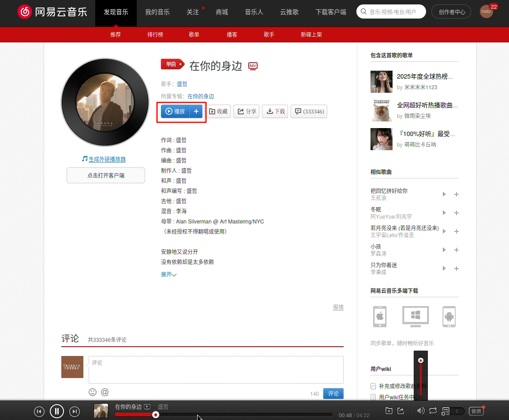
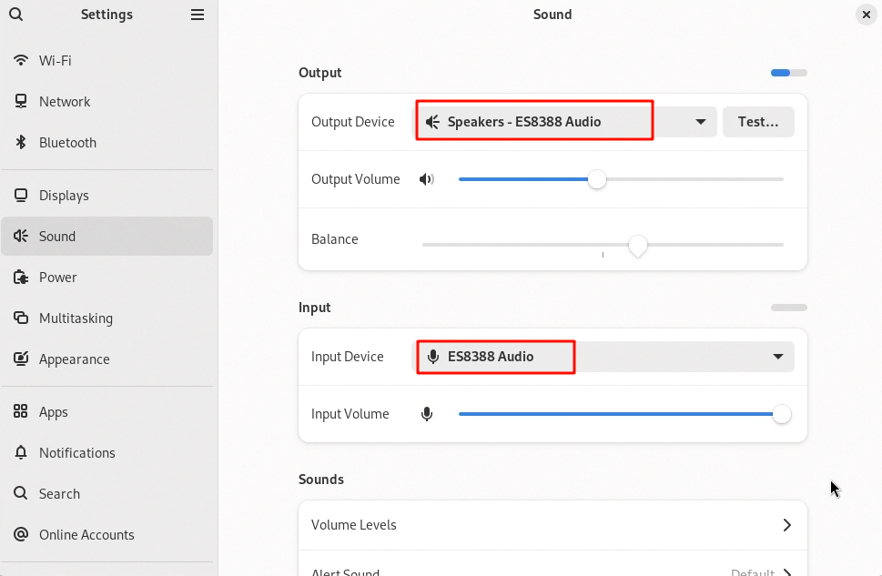

# 音频功能测试

本章节将指导您在 DshanPi-A1 上测试音频播放与录制功能。

## 1. 播放声音

Armbian 系统默认已开启**扬声器 (Speaker)** 和**耳机 (Headphone)** 输出通道。您可以通过以下两种方式测试音频播放：

### 方法一：浏览器播放
直接打开浏览器访问音乐网站（如网易云音乐），播放任意音频。



### 方法二：命令行播放
如果您有本地音频文件（例如 `output.wav`），可以使用 `aplay` 工具进行播放：

```bash title="播放本地音频"
aplay -f cd output.wav
```

:::info 声卡信息
系统默认使用的声卡为 **ES8388**。

:::

## 2. 录制声音

Armbian 系统默认开启的是**板载麦克风 (Mic)** 输入通道。

:::warning 注意
由于硬件限制，系统同一时间只能激活一个输入通道（板载麦克风或耳机麦克风）。
:::

### 2.1 使用板载麦克风录音

执行以下命令开始录音（默认配置）：

```bash title="录制音频"
# -f cd: 使用 CD 音质 (16bit, 44.1kHz)
# -vvv: 显示实时音量柱
arecord -f cd output.wav -vvv
```

录制过程中，终端会显示实时的音频数据流信息和音量柱（VU meter）：

```text
Recording WAVE 'output.wav' : Signed 16 bit Little Endian, Rate 44100 Hz, Stereo
Max peak (11024 samples): 0x000001c4 #                    1%
Max peak (11024 samples): 0x00008000 #################### 100%
Max peak (11024 samples): 0x00008000 #################### 100%
Max peak (11024 samples): 0x00006112 ################     75%
Max peak (11024 samples): 0x00007ac6 #################### 95%
Max peak (11024 samples): 0x00006d64 ##################   85%
...
```

> 按 `Ctrl+C` 结束录制。

### 2.2 切换至耳机麦克风录音

如果需要使用耳机插孔中的麦克风进行录音，需要手动切换音频输入通道。

**步骤 1：关闭板载麦克风，开启耳机麦克风**

```bash title="切换到耳机输入"
amixer -c 0 cset numid=70 0  
amixer -c 0 cset numid=71 0  
amixer -c 0 cset numid=68 1  
amixer -c 0 cset numid=69 0  
```

**步骤 2：恢复为板载麦克风**

测试完成后，如果想切回默认的板载麦克风，请执行：

```bash title="恢复板载麦克风"
amixer -c 0 cset numid=70 1
amixer -c 0 cset numid=71 1
amixer -c 0 cset numid=68 0
amixer -c 0 cset numid=69 1
```
